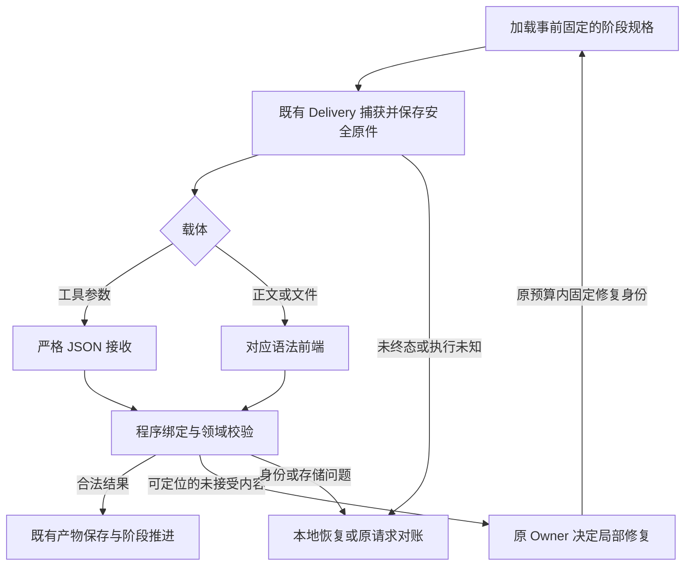

# ADR-005 Agent 结果处理与产物交接

- 状态：**显式 profile 软件实施与验收完成；2026-10-10 用户授权新 Attempt 默认 rollout 已在源码配置**。实际完成范围及审查见第 27.6 节与原 Task；旧 Attempt 的冻结 pin 保持，旧版将在真实成片验证后另行删除。此项不表示 B SourceUnit 迁移、部署或真实视频 E2E 已完成。
- 日期：2026-10-09。
- 范围：Easel 视频主线的模型结果接收、表示解析、程序绑定、局部修复、文件交接和冷恢复。
- 所属实施任务：[自主首版唯一 Task](../tasks/creator-autonomous-first-cut-2026-09-30.md)，细化其中 O4 与 O5；实施以原 Task 的最新授权范围与实际阶段阻塞为准。
- 架构约束：[ADR-001](ADR-001-creation-hypit-mainline.md)、[ADR-004](ADR-004-material-layer-v1.3-baseline.md)、[视频架构](../architecture/easel-video-architecture-v1.md)、[Material V1.3](../architecture/material-layer-v1.3.md)。
- 代码核查：分支 `easel-studio`，读取时 HEAD 为 `d5bd227c2b6750ae18cea06ebcf4f9f89350899b`；工作树包含其他窗口的既有改动。HEAD 不能单独代表全部已读文件，实施时须刷新相关源码、测试、协议及实际安装依赖的指纹。
- 初次写回为本 ADR 与索引；2026-10-09 用户追加授权后实施。首次写回见第 27.3 节，实施核对见第 27.5 节，本轮软件验收和边界见第 27.6 节。

## 1 需要作出的设计决定

采用“**既有接收边界 + 按格式适配 + 程序绑定已知数据 + 原领域验收**”的方式收敛模型结果处理。

统一四件事：结果的身份、接收结论、诊断结构、可重建的处理证据。保留各格式及业务模块的判断能力。模型只产生当前需要新增的语义、选择、正文或工程修改；已冻结的身份、已保存的事实和工具已经确认的结果由程序持有。

本方案作出以下具体选择：

| 决定 | 采用的方案 | 原因 |
|---|---|---|
| 共用接收基础 | 扩展 `output_contract.py`、`output_admission.py` 与 `output_receipts.py` | 这些模块已存在原件、规则、回执和恢复机制，避免出现第二个接收真相 |
| JSON 正式入口 | 保持完整、严格解析；仅按已登记规则规范化 | 原生工具身份、重复键、截断、非有限数等问题不能由宽松修复掩盖 |
| 正文 | 按阶段接收完整文本或固定文件，交给对应文档解析器 | 不为统一外壳而把所有正文嵌套进大 JSON |
| Markdown | 引入 `markdown-it-py` 的块结构解析；业务分类继续由 Easel 定义 | 标准语法与旁白／制作指令的含义是不同职责 |
| SVML、SVRun、SVS | 优先使用已安装 Hypit 的原生前端；最终继续执行 `hypit check` | SVML 含 typed reference 等专用语法，不是标准 XML |
| 来源引用 | 扩展现有 source catalog，以程序生成的引用单位代替模型回抄 | 保留完整来源、角色和语义复核，减少文字变形及超长引用 |
| 素材观察 | 首个既有批次交付事实，后续批次交付基于该事实版本的检查增量 | 不增加一个专用观察 Agent，也不默认多加一次模型调用 |
| Quality | 程序持有已决检查及旧帧；模型仅提交本轮未决部分与新证据 | 最终仍生成当前合同要求的完整审查报告 |
| 文件处理 | 区分原件快照、规范化派生、只读验证、正式发表 | 现有部分 validate 路径会改写文件，重放不能假装无副作用 |
| 修复 | 沿用各阶段既有 Owner、范围和预算 | parser 不调模型，不增加全局重试层 |
| 框架 | 当前不迁移 OpenClaw，不引入第二套 Agent/工作流引擎 | 采用开源项目的接口边界与恢复方式即可 |
| 通用修复库 | 本版不将 `json_repair`、任意 fuzzy 匹配或 LLM 格式修复器接入正式接收 | 当前可靠收益主要来自减少回抄及专用解析；宽松恢复须另有真实失败样本和语义保持证明 |

## 2 目标与不变量

### 2.1 产品目标

本方案服务于“Creator 确认后，自主产生可审阅视频首版”。不把完成全部解析治理作为第一条工程视频的总前置条件。

预期可验证的改善是：减少仅因包装和机械回抄产生的失败，避免存储失败导致模型重跑，使每个拒绝都能定位到正确责任层，并使在线路径和冷恢复使用同一套处理规则。

不承诺某个模型成功率、不把历史坏结果重新计为成功，也不以减少校验数量作为完成标准。

### 2.2 必须保持的行为

| 不变量 | 必须保持的含义 |
|---|---|
| 唯一生产主线 | Creation → Preparation → Planning/Truth → Material/Rights/Readiness → Authoring → Hypit → Quality |
| 领域职责 | Material 不拥有导演、时间线或 Build 权；Hypit 不拥有 AI 素材生成权 |
| 正式合同 | MaterialPlan/Need、requirements、MaterialBundle、Rights、Match、Readiness 继续由现有模块验证 |
| 真实证据 | 工具调用成功、结果可解析、业务结果合法、阶段就绪分别判断 |
| 原件 | 允许保存的原始回复、源文件和旧回执不被新规范化覆盖 |
| 身份 | Creation、Attempt、request、原 run/tool、来源、版本、hash 的绑定不由模型自行声明成立 |
| 语义 | 不发明硬条件、不将 required 改为 optional、不将真实冲突改成通过 |
| 有效负面结果 | `not_met`、`unknown`、`CONFLICT`、`UNRESOLVED` 可能是合法业务结果，不自动作为格式错误修成正面结果 |
| 预算 | 轮询、本地重解析不产生新模型调用；修复和必要重审仍占原预算；重启不刷新额度 |
| 未知执行 | 发送后状态未知时观察原请求；不因换 parser、session、Attempt 或模型而自动重派 |
| 历史兼容 | 旧请求按原版本恢复；新策略只作用于事前固定该策略的新请求 |
| 已放宽行为 | 新 intake@6 的 queries 保持 0～3；visual@2 保持完整唯一 ID 重排及空字符串 preference_notes |
| 范围 | 不新增自动 quota 查询；不恢复旧 FAIL；不改变发布或外部执行边界 |

`MATERIAL_READY` 仍是当前 qualified MaterialBundle 对 required Needs 的确定性判断；不恢复旧版本中通用 Hypit Binding 的概念。相关权威见 ADR-004 与 Material V1.3 的 MaterialReadiness 章节。

## 3 当前基础与需要收敛的接点

以下“现状”来自本次读取的源码，不将已实现能力重新列成从零开发任务。

| 接点 | 当前事实 | 本方案的变化 |
|---|---|---|
| `output_contract.py` | 已有 ACCEPT/NORMALIZE/BOUNDED_REPAIR/REJECT | 复用枚举；附加统一诊断载体 |
| `output_admission.py` | 完整对象解析、有限数、重复键、编码、安全检查、两条窄规范化 | 收敛 Python 解析行为；规则仍需按 profile 显式登记 |
| `planning_capture.py` / `openclaw_delivery.py` | 原 run、终态、工具和完整原文先于 admission 验证 | 保持这些职责；接收器不能绕过前置拒绝 |
| `output_receipts.py` | 事前 policy、raw/candidate/receipt、冷重算、存储异常 | 新消费者获得类型化拒绝；旧调用保留原协议 |
| `usable_result()` | 拒绝结果返回 `_invalid_json` 普通字典 | 新入口使用带诊断的结果或明确异常，不把错误交给业务 Schema 伪装成缺字段 |
| `semantic_boundary.project_proposal()` | 正式 Plan/Need IDs、source clauses、requirements 已由程序生成 | 直接复用；不删除正式合同中的来源证据 |
| `planning_input_view.py` | 已有 scope handle、输入视图、UTF-8 source position | 复用目录和映射，补齐引用单位，不另建权威来源数据库 |
| `planning_review_support.py` | source handle 已存在，模型仍给 quote/role；quote≤512 | 新版通过预计算引用单位表达锚点；保持角色与支持关系复核 |
| `script_truth.py` | 逐行／正则分割；claim 顺序编号；来源 quote 须完整相等 | 文档结构版与 source-ref 版分别版本化，避免一次改变全部语义 |
| Material 分组观察 | 同帧 facts 保存后要求模型逐字回抄 | 新模型协议只回 checks 和显式事实异议；正式报告由程序构造 |
| Quality | 程序已有 resolved_checks/resolved_frames，模型仍回抄 | 新模型增量协议；完整正式报告保留 |
| Authoring prepare/selection | 已复制冻结正文、生成 timing、从 SVML 引用记录 selection | 收敛现有提取和规范化流程，避免重复开发 |
| `hypit/revision.py` | 正则给 typed ref 加引号、改标签前缀后 ET 解析；SVS 手工 token 扫描 | 以原生语法结果替代相应部分，业务保护图继续由 Easel 检查 |
| `validate_authored_selection()` | 检查同时会改 selection、Run sidecar、SVML 声明 | 新流程显式产生派生记录，并在只读验证后发表 |

### 3.1 当前版本必须分别看待

- 内部结果分类：`model-output-contract@1`。
- JSON 接收：`model-output-admission@1`、`model-output-admission-receipt@1`。
- 通用消费者持久化：`stage-output-receipts@1`。
- Planning 原生提交合同：`planning-result-v3` / `easel-structured-result@1` / `submit_semantic_plan`。
- Planning 当前 intake：`confirmed-planning-intake@6`；现有历史 transport/checkpoint 独立保留。
- Material 要求合同：`visual-requirements@1/@2`。
- 当前 Material 模型回复：要求 @2 时用 `material-compact-observation@5`，旧路径 @4。
- 当前正式观察报告：`easel-visual-observation@2`。
- 当前 Quality：`easel-output-quality@6`。
- 当前 Script 审阅回复：`easel-script-assessment@1`。

这些编号不能用一个全局“解析版本”替代。后文所有“新版本”都是设计槽位，实施时在当前版本集合上分配，不提前冒充已登记的实际协议。

## 4 开源实现提供的依据与采用范围

| 一手来源 | 已核实机制 | Easel 采用范围 |
|---|---|---|
| [OpenHands Tool System](https://docs.openhands.dev/sdk/arch/tool-system) | Action → Executor → Observation；事件包装由 Agent 层负责 | 模型参数、执行事实、领域就绪分开 |
| [OpenHands Structured Output](https://docs.openhands.dev/sdk/guides/structured-output) | 可从保存的工具调用重新读取有 Schema 的返回 | 重放依据保存事件及原件，不依赖最后一段总结 |
| [Aider EditBlockCoder](https://github.com/Aider-AI/aider/blob/main/aider/coders/editblock_coder.py) | 固定修改协议；分别反馈已应用与失败块 | 修复只处理明确失败部分，记录实际效果 |
| [Codex patch parser](https://github.com/openai/codex/blob/main/codex-rs/apply-patch/src/parser.rs) | 文法解析与文件应用分离 | 语法成功不等于操作或任务成功 |
| [smolagents](https://huggingface.co/docs/smolagents/en/guided_tour) | 代码表达工具组合，执行器返回结果 | 机械数据处理由程序承担 |
| [PydanticAI Output](https://pydantic.dev/docs/ai/core-concepts/output/) | 类型化结果、文本处理器、输出函数、选项映射已有对象 | 缩小模型责任；按正文/决策处理 |
| [LangGraph 状态](https://docs.langchain.com/oss/python/langgraph/graph-api) | 节点返回更新，程序按 reducer 合并 | 事实与已决检查由程序持有 |
| [LangGraph 恢复](https://docs.langchain.com/oss/python/langgraph/checkpointers) | 历史 replay 会重执行后续节点 | 本地重解析与新阶段执行明确分开 |
| [mini-swe-agent 环境](https://github.com/SWE-agent/mini-swe-agent/blob/main/src/minisweagent/environments/local.py) | 命令结果保留退出码、输出和提交信号 | 提交与验收分开 |

上述项目也保留格式容错。它们提供的是可参考的工程边界，不构成 Easel 语义正确性或现有模型成功率的证据。本方案不复制它们的宽松文件名猜测、任意内容匹配或从自由评分报告推进状态的做法。

## 5 责任分配

### 5.1 按数据所有者划分

| 数据 | 模型是否生成 | 程序职责 |
|---|---|---|
| 文案、镜头意图、素材用途、未决语义判断 | 是 | 按原创作合同、来源与独立审核校验 |
| scope、素材或来源的选择 | 选择给定引用 | 校验存在性、资格、角色和当前上下文，再解析引用 |
| Creation/Attempt/Plan/Bundle/运行身份 | 否 | 从当前上下文和真实执行记录绑定 |
| 固定主题、规格、已确认正文 | 新协议不回抄 | 按冻结原件引用或复制 |
| 同帧已确认 facts | 后续批次不回抄 | 维护版本、依赖及冲突处理 |
| 已完成 Quality checks | 后续轮次不回抄 | 合并未决增量并保留原证据 |
| 路径、大小、hash、exit code、Build ID | 不作为权威声明 | 从真实文件、工具响应和现有执行器生成 |
| NORMALIZE、receipt、repair budget、阶段 READY | 否 | 由对应程序 Owner 决定 |

新 wire Schema 应删除程序字段；不能继续要求模型输出这些字段，再无条件用正确值覆盖。旧协议若要求回抄，仍按旧规则核对；不同值不能被“程序绑定”掩盖。

### 5.2 模块边界

- Delivery/Harness：运行身份、完整性、终态、原结果捕获和对账。
- 结果接收：表示解析、已登记的等价规范化、结构诊断。
- 阶段 adapter：将已校验的引用与冻结上下文绑定，返回现有领域输入。
- 领域模块：Truth、语义必要性、Rights、Match、Readiness、Quality。
- 现有 Owner：局部修复范围、调用预算、停止与恢复。
- 产物 writer：安全原件、派生内容、正式发表与本地恢复。
- Hypit：自己的语法、依赖解析、媒体合同、编排、Runtime、Build。

## 6 目标处理流程



上述节点是职责图，不引入新的通用工作流状态机。已有 Delivery、Planning journal、Material report、Hypit service 状态继续是实际调度依据。

接收过程必须区分三种变换：

1. **Decode/Normalize**：改变表示，保持同一阶段约定的业务信息。
2. **Bind/Derive**：从冻结权威值生成程序字段，有来源和派生规则。
3. **Repair/Edit**：修改模型的未接受内容，产生新候选和修复 lineage。

三者不能共享一个含糊的 `cleaned=true` 标记。

## 7 结果规格与内部接口

以下是设计接口，不是现有模块已经导出的 API。实施时优先在现有类型和字典结构上增量增加；不要求为每个概念新建文件或数据库表。

### 7.1 ResultSpec 由程序在派发前固定

```python
@dataclass(frozen=True)
class ResultSpec:
    revision: str
    stage: str
    channel: str                 # tool / text-json / file-json / text / file
    format: str                  # json / markdown / svml / svrun / svs
    profile: str
    schema_ref: str | None
    schema_sha256: str | None
    binding_ref: str
    binding_sha256: str
    parser_revision: str
    normalizer_rules_sha256: str
    limits_ref: str
```

设计规则：

- `ResultSpec` 只描述如何消费某个阶段结果，不含新授权或可执行模型命令。
- JSON 阶段绑定实际动态 wire Schema；正文/文件阶段绑定格式和目标文件合同。
- `binding_ref` 指向现有冻结输入、原请求、来源目录及阶段对象，不复制所有正文。
- 限制包含 raw bytes、items、depth、可用引用与诊断上限；它们来自阶段能力。
- 先持久化 policy/identity，再生成请求和派发。模型不能选择 profile、限制或 parser。
- 已有 `pin_policy()` 和 Planning transport identity 是实际接点。新字段进入新版本 identity；不能向旧 receipt 任意追加字段改变 hash。

### 7.2 CapturedResult 来自原执行或原文件

```python
@dataclass(frozen=True)
class CapturedResult:
    capture_ref: str
    origin_ref: str               # existing run/tool/file capture identity
    channel: str
    raw_sha256: str | None
    raw_bytes: int | None
    safe_raw_ref: str | None
    completion_code: str
```

它由 Harness 或受控文件读取器构造。内容不完整、未安全保存或只剩拒绝摘要时，不伪造 `safe_raw_ref`。结构化工具原始 arguments 与 SDK 解析后的 arguments 的核对继续保留在 Harness。

### 7.3 Diagnostic 保留错误类别及定位

```python
@dataclass(frozen=True)
class ResultDiagnostic:
    code: str
    layer: str                   # syntax/schema/binding/semantic/artifact/...
    stage: str
    field_path: tuple[str | int, ...] | None
    artifact_ref: str | None
    source_location: dict | None  # requires explicit unit and source digest
    scope_ref: str | None
    expected_constraint: str | None
    actual_summary: dict | None  # bounded, redacted statistics only
    repair_owner: str | None
```

`field_path` 使用结构化 path，展示时再编码为 JSON Pointer。字符串中的斜线、点、数字不能被含糊拆分。位置必须附单位，见第 11 节。

不直接持久化异常原文、整个坏字段或 provider response。沿用白名单诊断；总数和 omitted 数单列。修复包需要的内容从已安全捕获的候选及合法来源中读取。

### 7.4 Admission 与领域结果是两个对象

```python
@dataclass(frozen=True)
class AdmissionResult:
    decision: OutputDecision       # existing four outcomes
    candidate: object | None
    diagnostics: tuple[ResultDiagnostic, ...]
    receipt_ref: str | None

def admit_captured(spec, captured, context) -> AdmissionResult:
    """No model call, no domain state transition."""

def bind_candidate(spec, candidate, frozen_context):
    """Resolve known references and derive program-owned fields."""
```

实际领域 validator 返回原来的 Material/Truth/Quality 类型及原 verdict。通用层不另造“所有业务通过”的布尔值。

正式消费使用 `require_accepted_candidate()`，只接受 ACCEPT/NORMALIZE；未接受结果不能由此进入正式发表。BOUNDED_REPAIR 的安全候选由已登记的阶段 Owner 按现有 eligibility 检查取得并计算修复 targets。Planning 保留 `require_selection_admission()` 的现有语义，不用通用正式消费门阻断其局部修复。

纯 admission receipt 保存固定接收器自己的 decision，写入后不因 Owner eligibility 改写。新 profile 的 Owner 分类另存于既有阶段 journal/修复记录，绑定原 receipt、候选 hash、资格规则版本和 targets；专用 repair 入口同时检查这两层证据。旧 profile 保持原有组合记录格式及回放语义，不补写新字段改变旧 hash。

完成阶段资格判定后仍为 REJECT 的结果，抛出带明确诊断的 `ModelResultRejected`。存储与完整性失败继续使用 `OutputReceiptError`，不能被 broad `except ValueError` 混入模型修复。旧 `usable_result()` 的行为只留给显式 legacy 分支。

## 8 Profile 与版本登记

登记表采用源码中的小型固定映射，不做运行时插件发现、不由模型创建规则。

| 阶段 | 当前载体 | 新设计接收方式 | 不能误用的回退 |
|---|---|---|---|
| A-selection/details | 原生指定工具 | 现有 v3 完整 capture → JSON profile → 原 schema/语义链 | 不从 prose、其他工具、日志或文件救回 |
| B 与局部 repair | 现有结构化 carrier | 原 wire codec、source catalog、独立版本的 support | 不通用地再次解析字符串 slots |
| Material classification | 完整文本 JSON | 现有完整 fence profile；ID 对齐 | 不重排有创作时序的数组 |
| Material group checks | 完整文本 JSON | 新紧凑 reply revision；程序合并 facts | 不接受缺 ID、bool ID 或错帧 |
| Script/Voice Truth | 指定 JSON 文件/既有 capture | strict profile；新 source-ref reply 单独版本化 | 不改 CONFLICT/UNRESOLVED |
| SCRIPT/SCENES 正文 | 当前冻结文件 | 保留 bytes，文档 adapter 只做对应结构检查 | 不把任何标题或正文“清洗掉” |
| Authoring | 固定 workspace 文件 | 捕获文件集 → Hypit 原生前端 → 现有域验证 | 不以 XML 容错器或任意文件替代指定产物 |
| Quality | 当前组 JSON 文件 | 新增量回复 → 程序构造完整原合同报告 | 不删缺陷或重写已决 checks |
| Hypit CLI 响应 | 工具的 JSON 输出 | 保持 HypitCLI 的工具协议和状态对账 | 不按模型文本容错、不把非零退出一律重跑 |
| 代码/文档 patch | OpenClaw 既有工具能力 | 本期沿用执行器；只接收真实文件变更结果 | 不在 Easel 重新实现通用代码 Agent |

JSON profile、语义合同、观察协议、文档 extractor、Hypit parser 和缓存 identity 独立版本化，便于单项升级和旧路径保留。

## 9 通用处理算法

### 9.1 阶段接收算法

1. 从已固定请求加载 ResultSpec；不存在或 identity 不一致即停止本地处理。
2. 由既有 Delivery 观察原 run，或按已固定路径捕获产物。未终态时保持 pending。
3. 执行当前渠道的大小、编码、敏感内容、工具身份和完整性检查，包括该渠道现有的前置严格解析。通过后立即按原合同保存允许留存的安全 capture；被拒内容只保留允许的摘要。
4. 用指定 profile 解析完整载荷。只允许约定包装，不遍历格式列表“试到成功”。
5. 执行固定顺序的等价规则及 wire Schema 检查，保存 admission 结果、动作和诊断；不等到最终业务通过才保存接收证据。
6. 原阶段完成 eligibility/引用检查，绑定程序字段；任何后续派发所依赖的 binding 先落盘。
7. 执行对应领域校验。合法负面结果进入正常领域分支。
8. 若有符合原资格的可修复错误，阶段 Owner 固定目标与预算并先保存，再派发原有修复；接收器不自行修复。
9. 达到相应领域发表条件后，保存领域候选、派生记录和正式产物。
10. 更新原阶段状态，不新造 READY shortcut。

### 9.2 对已有前置严格解析的处理

当前 Planning JSON 在 Node guard、`_capture_original()`、`planning_capture.capture()` 中已有前置解析。新 admission 不能处理已被这些入口拒绝的文本。

实施策略分两层：

- Python 侧可提取共享实现，但保留由固定协议选择的兼容 wrapper。finite、编码等接受规则的一致化只在新 parser/profile revision 中启用；旧 capture/checkpoint 继续原接受及诊断语义，不能同一 revision 下静默收紧。当前不同前置 parser 的差异不等于已证明能穿透最终领域验收。
- Node 侧保留运行时 guard，以同一组无敏感 fixture 验证跨语言边界。Node guard 与 Python domain receiver 是不同信任边界，不因“重复”就删除一层。

本方案不让坏 JSON 绕过安全捕获再进入 repair 库。只能保留安全诊断的拒绝，依旧没有可重放的完整候选。

### 9.3 完整性先于展示和流式解析

流式片段可供进度展示，但不作为正式候选。必须取得终态与完整字节后才能验收。length、缺片、多目标工具、错误工具、终态后额外参数不能通过补括号或取最后一次回复变成合法结果。

## 10 规范化规则与程序派生

### 10.1 首版规则集

| 规则 | 必要前提 | 处理 |
|---|---|---|
| 完整 JSON fence | channel 明确允许；整个容器闭合；外侧仅空白 | 剥包装后完整严格解析 |
| BGM contains 回显 | 精确命中当前已登记等价条件，外层与 item 合法 | 仅移除该冗余回显 |
| ID 顺序整理 | 该数组定义为按 ID 的集合；完整、唯一、类型正确 | 按程序预期次序排列，保留原件 |
| 已登记 legacy codec | 原协议、identity、输入版本均匹配 | 按该 codec 转换；不扩散到新原生工具 |
| Hypit 声明适配 | 明确旧声明形态与目标方言；原件已捕获 | 作为文件派生动作记录，不伪装为只读校验 |

程序绑定、补入明确软偏好来源、生成 IDs、复制冻结文件属于 derivation；不把它们包装成 JSON 清洗规则。

### 10.2 明确不允许的操作

- 第一段 JSON、最后一个工具调用、最像的文件、最长的代码块等启发式选择。
- 补齐截断对象、丢掉尾部错误、选择多根数据中的一根。
- 通用删除 extra、把 `"false"` 转 bool、把 `null` 当空字符串。
- 用模糊文本匹配自动绑定冻结来源、素材身份或 quote。
- 截断义务或来源来满足长度上限。
- 重排分镜、Need 序列或具有创作顺序的数组。
- 用程序拥有的正确值覆盖旧协议中模型提交的错误身份后继续接受。
- 将合法拒绝结论改成成功以减少修复。

### 10.3 规则应满足的性质

在固定 input/schema/policy 下，结果确定；对已经规范化的值再次处理不改变业务结果。第二次处理可以没有新的 normalization action，因此不要求“对原件的第一次 receipt”与“对规范结果的第二次 receipt”完全相等。

规范化过程有固定顺序和次数上限。现有上限 16 动作、32 条诊断继续作为旧 profile 合同；新 profile 是否调整需容量证明，不因错误多而静默截断业务内容。发生一次 normalization 后若仍有错误，不能计整份结果成功。`output_admission` 本体在剩余 Schema 错误存在时返回 REJECT；只有阶段 Owner 通过既有形状、引用和修复资格检查后，才可将安全未接受候选分类为 BOUNDED_REPAIR。

## 11 来源引用与坐标契约

### 11.1 复用现有 source catalog

继续由 `planning_review_support.source_catalog()` 从冻结 evidence 派生叶子目录，由 `SourceSelection` 维护 scope 的可逆映射。二者含义不同：

- `src_<digest>`：模型选择的业务 scope。
- `source-0000`：当前冻结问题批次内的 evidence 叶子。
- 文档 span：来源文本中的明确位置。
- claim/requirement ID：被审核对象的身份。

任何两种 ID 均不通过字符串相似性互换。有效 handle 只证明“引用存在”，不证明来源具有所选 authority 角色或足以支持判断。

### 11.2 新引用单位的结构

```python
@dataclass(frozen=True)
class SourceUnit:
    unit_id: str
    source_handle: str
    source_catalog_sha256: str
    source_value_sha256: str
    span_unit: str | None          # utf8-byte for new text slices
    start: int | None
    end: int | None                # half-open
    text_sha256: str | None
    allowed_roles: tuple[str, ...]
```

完整 value 和原文继续保存在现有冻结 source catalog 中。SourceUnit 只是确定性派生的索引，不成为第二套来源事实。

新版模型回答中的 support 建议为：

```json
{
  "source": "source-0007",
  "units": ["unit-0007-02"],
  "role": "authority"
}
```

- source 与 units 都只能选本题允许集合。
- 字符串来源的 units 必须非空；非字符串来源使用已登记的 whole-value 单位，不能让模型把对象序列化成 quote。
- units 顺序按原文位置校验；重复或跨 source 的引用拒绝，不猜测。
- unit ID 作用域由当前 catalog/问题绑定，不是可跨作品复用的全局 ID。
- 程序解析单位并生成准确原文、位置、hash，模型不回抄这些字段。
- role 仍需显式回答并通过现有资格规则；程序不从“相似来源”推断 authority。

### 11.3 引用单位如何生成

优先使用现有来源结构：完整非字符串叶子、已有 literal line、明确段落或已有业务句子。每个单位同时保留原 source 的完整上下文，审核者能查看前后限定条件。

第一版引用单位保留现有 512 字符锚点长度作为有界单位选择，但这不是新旧 support 语义等价的证明：

1. 原字符串不超过 512 个 Python Unicode 字符时，可以作为单个单位。
2. 较长字符串先按保留分隔符的物理行/段落生成单位。
3. 仍过长的段落按标点句界进一步拆分；不能直接截取前 512 个字符当完整支持。
4. 单个不可安全分割且超过上限的单位保持显式 `UNREPRESENTABLE_SUPPORT_UNIT`；该阶段不启用新引用 profile，不能删句或扩大当前载体假装无损。
5. 新 Schema 每个 support 的 units 为 1–16 个合法 enum 引用；每个 answer 仍最多 16 个 support，另由 validator 限定整个 answer 总 unit 引用数不超过 16。数量上限与动态 Schema 的最大序列化体积共同固定，不能收到回复后才决定丢哪些引用。
6. 新 support 内部合同必须保留位置和 unit identity。固定段落不能表达所有旧任意子串；同 source 两处相同文本展开为旧 quote 会丢位置、甚至触发旧重复引用检查。只有逐项投影无损且展开后仍不超过旧 16 条上限时，才可额外生成兼容视图；新语义验收不依赖这个有损风险视图。

因此，首个单位引用 profile 同时版本化 `Support/SupportedAnswer/CandidateAnswer`、普通 review、candidate correction、repair/patch 动态 Schema、slot decode、support validation、`maximum_compact_bytes` 容量证明、transport identity 与 replay。旧 @1 继续按原任意子串规则回放；不是把 quote 字段简单换成 ID。

512 不是事实真假标准，也不准截断完整来源。若冻结来源无法形成合格单位或容量不足，在派发前选择已有、另行固定身份的旧 profile，或给出明确不支持；不能新回复失败后临时降级。需要放宽单位大小时，升级对应支持链与容量证明，不修改旧合同。

### 11.4 完整语义复核仍然存在

B 接收原问题、完整必要来源上下文、候选语义及引用单位；它仍判断引用是否支持 ACCEPT/CHALLENGE 等结论。ID 合法而含义不支持时，应报语义问题，不能由 parser 放行。

来源版本变化会使单位目录、问题绑定和相应已接受审核失效。程序不得把旧 unit handle 重新指向新正文。

### 11.5 三种位置单位的转换

| 现有位置 | 当前含义 | 新设计处理 |
|---|---|---|
| Planning literal source position | UTF-8 bytes，半开区间 | 继续原语义 |
| `visual_contract` authority start/end | Python 字符串索引 | 旧字段保持原单位；只在显式 adapter 转换 |
| Hypit 原生 offset/range | JavaScript 字符串索引产生的位置 | bridge 明确标注 utf16-code-unit，经边界校验后转换 |
| Markdown token `map` | 块级起止行 | 从原始保留换行字节建立行起点映射，不冒充内联字符坐标 |

转换算法统一要求：

- 输入必须是与 hash 绑定的同一份 UTF-8 原件。
- 不先做 NFC、智能标点、换行或 trim 归一化。
- 建立 Unicode code point、UTF-8 累计字节和 UTF-16 累计单元的单调映射。
- 不允许落在 UTF-8 多字节内部或 UTF-16 surrogate pair 中间。
- CRLF 按原始两个字符/字节参与计数。
- 统一使用半开区间；起止顺序、边界、slice hash 均核对。
- 新记录优先保存 UTF-8 byte span，同时保留原生坐标及其单位，方便定位和比对。
- 旧字段不被原地重新解释。转换版本进入相关 policy identity。

必测样例包括中文、emoji、组合字符、CRLF、重复子串、空行、段落末尾标点和 source 数组重排。

## 12 Markdown 与 Script Truth 设计

### 12.1 为什么不能只替换一个 split 函数

当前 `script_truth._units()` 的提取顺序直接决定 `claim-0001` 等 ID，ledger 又从同一算法重建。改 parser 会改变审核单位、覆盖集合和历史 ledger。

因此分两个独立实施单元：

1. 先改变审阅回复的来源表达，保留现有 claim 提取和 IDs。
2. 再引入新版 Markdown extractor/ledger，由新确认或新 Script 版本启用。

不能把 Markdown 新 parser 用到旧 frozen ledger 后，仍声称是同一份审阅。

### 12.2 文档语法

后端使用 `markdown-it-py`，启用明确的 Markdown 方言。默认 CommonMark；表格等扩展只有项目实际采用并完成容量/覆盖测试时登记。前端 `marked` 的版本不决定后端审阅语义。

保留完整文档原 bytes。token tree 用于识别标题层级、段落、列表、引用和代码围栏，不直接以 HTML 渲染结果作为来源。

### 12.3 ScriptUnit 的最小设计

```python
@dataclass(frozen=True)
class ScriptUnit:
    unit_id: str
    script_sha256: str
    extractor_revision: str
    block_type: str
    source_block_span: SourceUnit
    unit_ordinal_in_block: int
    review_text: str
    review_text_sha256: str
    declared_role: str             # narration/direction/onscreen/unspecified
```

第一版只承诺准确的**块级原文 span**。若将块内文字按现有句界进一步分为审核单位，保存 `unit_ordinal_in_block` 和可重算的 review_text，不伪造 parser 未提供的内联精确 byte span。

review_text 是有版本的展示投影，source_block_span 是原文证据；两者分别保存 hash。转义、强调、链接等导致表示变化时，不能宣称 review_text 与原 bytes 完全相同。

### 12.4 角色与 coverage 规则

- 已约定的“旁白/配音/屏幕文字”等标题可赋予对应 role。
- 制作约束章节可以标为 direction，但正文仍保留在 ledger 或明确的覆盖记录里。
- 未知标题中的自然语言不能默认忽略，使用 unspecified 并进入保守审核。
- 列表和引用保留为文档内容，不因语法前缀被自动排除。
- 代码块、表格、内嵌 HTML 等不能静默从审阅范围消失。阶段不支持的形式返回明确文档不支持诊断；已声明为制作代码的块可按既有规则另行记录，不当作用户事实。
- 所有可读正文块必须有“审阅单位”或“明确业务理由的非 claim 覆盖记录”，防止 parser 换库后漏审。
- 现有 128 KiB Script、1000 units、单句 4000 字符等旧边界保持于旧 profile；新 extractor 的限制需按同样产品范围证明，不在解析时静默裁切。

### 12.5 Truth reply 去回抄

当前 `easel-script-assessment@1` 要模型回传 Script/Truth hashes，sources 内 quote 还需等于完整冻结来源。新 reply 应让模型只返回当前被分配的 claim 决策及 source refs。

程序绑定 Script/Truth 身份，并由合法 source refs 回填现有正式审阅结构。前提是请求已固定这两个原件身份，且 reply 不能携带冲突的程序字段。

`supported_paraphrase / creative_expression / rewrite_required / unresolved` 的含义继续保持。格式修复不能要求模型将后二者改成前两者。当前 validator 只证明 provenance/coverage，不宣称能自动证明语义蕴含；必要的模型审阅职责仍在。

## 13 Material 同帧观察与检查增量

### 13.1 数据分离

新增的内部表示区分：

- `FrameObservation`：针对某一实际采样图像的 observed、description、style、logo、text，以及原 capture 引用。
- `FrameCheckBatch`：针对某一 observation 版本和 requirement ID 集合的 checks。
- 正式 observation report：继续包含完整 frames、clauses、compact 原件和最终判定。

新模型回复协议独立于 `visual-requirements@2`。本方案不改变 required/preference、查询条数或 status 语义。

### 13.2 首次观察不额外加模型调用

对每个 frame：

1. 先核验实际采样图像和缓存 identity。
2. 没有可复用事实时，让该 frame 的**第一个既有 clause batch** 同时回答 facts 与本组 checks。
3. 初版保持当前确认条件：某组完整结果通过对应领域校验且 observed=True，才保存可复用 FrameObservation。checks 的**合同校验失败**或 observed=False 不能确认 facts；合法的 not_met/unknown 本身不是合同校验失败。
4. 每个既有组在派发前固定 reply mode：存在身份匹配且当前仍合格的 observation，才提供 `observation_ref`、冻结 facts 与同一图片，采用 checks delta；不存在时不能派发引用型 delta。
5. 未完成所有必要组前，不发表完整 observation report。

facts+checks 与 checks delta 使用明确不同的 reply Schema，按组派发前的可用事实选择并固定，请求发出后不切换。

首组 observed=False 是合法负面结果，保持原 Owner 的停止/继续规则。若原流程继续下一个原本就有预算的组，该组使用 facts+checks；不增加专用观察、不重问已完成组、不刷新 repair。后组首次确认 facts，也不能回填或改写早组已保存的 unobserved 判断；若各组证据不兼容或覆盖不足，整帧仍未解决，不能合并成虚假的完整通过报告。

现有视觉合同继续要求至少一个 required clause；零必要条款不能借本次去回抄改动新增观察或绕过原校验。未来纯偏好观察需独立合同。

示意：

```json
{
  "observation_ref": "obs-0001",
  "checks": [
    {"id": 3, "status": "met", "basis": "该项可从当前帧观察"}
  ],
  "facts_dispute": {"kind": "none"},
  "preference_notes": ""
}
```

这里的字段名为新 reply 设计；正式字段由 adapter 生成。每组要求的全部 ID、basis、类型条件继续按原语义验证。

### 13.3 新事实缓存 identity

当前 `frame-facts` 以 asset SHA 与完整 frame 字典作为 key；frame 已包含 index、seek_seconds 与实际 JPEG SHA，尚未绑定观察合同、提示/路由 policy 和当前资格。新版本至少绑定：

- asset SHA、实际 frame/JPEG SHA；
- seek_seconds 的既有规范表示及实际采样配置；
- frame 所属 manifest/采样版本；
- facts reply/validator revision；
- 影响事实表达的输入与提示 policy digest；
- 初期同时绑定当前 requirements/观察合同 digest；
- 派发前固定的模型路由、Runtime 要求及相关上下文 identity。

缓存查找 key 只含派发前已存在的输入事实。实际 capture ref、输出 hash 与实际 Runtime lineage 存在命中后的 observation 记录里，必须与原执行及固定要求核验；不能把尚未生成的 capture ref 用作首次查找 key。

缓存使用新前缀/版本，不读取旧 key 后直接当作新事实。对跨 Need 的纯事实复用，可在明确证明事实采样和提示独立于 Need 后再缩小 key；第一版优先避免复用到不同图像、方言或观察合同。

现有 prepare_observation 已记录 frame SHA 与 seek_seconds，应直接复用这些事实，不重新让模型计算。

### 13.4 真实冲突如何处理

后续组必须显式返回 `facts_dispute.kind = none | detected`。detected 分支包含受影响字段、具体观察依据和可选的新值，但它是“提出异议”，不能直接覆盖已保存事实。

处理规则：

1. 异议本身是合法结果，不应当作 JSON 格式错误。
2. 先在现有 journal/receipt 持久化 `observation_ref → dispute_capture_ref → 当前不可复用` 的关联，再将 frame 标为未解决并停止准入。原 observation/capture 和历史 receipt 不改写。
3. 第一版默认保留未解决并停止该 frame 准入，不新增事实复核调用。当前没有独立的 frame 级事实重审循环，不能把合法异议计作 JSON 修复来重问。
4. 若以后在原 Task 明确新增该语义复核能力，须事先固定 Owner、额度归属和停止条件；不能重置原组已用预算。接受的新 facts 才产生新 observation revision。
5. 依赖旧 facts 的 checks 失效；默认按整个 frame 失效。旧原件及判断保留供审计和原规则回放，但不能直接命中新 revision 的有效结果缓存。
6. 已完成正式报告发生事实改变，必须生成新的报告/输入版本，不能原地覆盖旧 PASS。

缓存命中、后续组派发、assemble_report、apply_observation 和冷恢复都必须检查这项当前使用资格。即使没有新的 facts revision，已存在未解决异议的旧版本也不得重新成为有效 prior。历史回放仍呈现当时的结果及之后的异议；它不能把历史有效误当成当前可继续使用。

这保留真实事实冲突的防线，同时取消后续模型逐字回抄的要求。

### 13.5 合并、恢复与容量

程序按期望 ID 顺序合并 checks，补入所引用 facts，生成完整报告。必须同时改到：

- `web/app.py:_observe_material_frames`；
- `visual_contract.validate_result/assemble_report/batches`；
- `visual_observation.apply_observation`；
- compact payload、缓存、receipt 和冷重建。

当前按 3000 容量做 batch 预估，且原回复捕获有 UTF-16 单元限制。新 wire 即使少了 facts，也须重新计算**最坏转义长度**，包含引用、异议分支和 Schema 包装；不能只按 Python `len(json.dumps(...))` 当 UTF-8/UTF-16/token 三种容量。

本单元不增加默认调用数或每组首次+一次 repair 的现有上限。被拒的组不抹掉已捕获的成功组；保留原件不等于其结论在新 facts 下仍有效。恢复先核验缓存身份、facts revision 和原件，再决定剩余工作。

新 compact delta 及其 normalization 保存模型实际回复；由程序补入的 facts 进入 derivation/full report，不写回原 compact reply 后仍声称是 raw。旧 `compact_results/result_normalizations` 在旧协议按原方式读取，新协议投影需要独立标识。

## 14 Quality 与 Voice Truth 的程序合并

### 14.1 Quality 增量回复

当前 Quality 已有总 identity、source_batch_sha256、resolved_checks、resolved_frames，以及对未决组补采一张图像的过程。直接复用这些基础。

新模型回复只允许包含：

- 当前未决 check ID 的完整决策；
- 本轮新帧，或明确未纳入 `resolved_frames` 锁定集合的待观察帧结果；
- 原合同允许的缺陷/证据及明确异议。

程序负责：

- 绑定 output SHA、execution fingerprint 和上下文；
- 合并已完成 checks 与本轮增量；
- 保留旧帧及其实际 SHA；
- 根据现有规则重映射 frame indices；
- 生成 `validate_visual_review()` 能验证的完整正式报告。

模型不得提交已锁定 check 的新值；若提出新矛盾，记录明确重审请求，由原 Owner 决定后续，不自动增调用。当前 `resolved_frames` 也可能包含 observed=False 的旧帧；delta adapter 不能自行重开这些帧。

当前入口让模型写 `.easel/quality/<input_sha>.json` 并按完整报告消费。新 profile 必须先捕获并验证 delta 原件，绑定冻结 resolved context 后派生完整报告，再执行 `validate_visual_review()`。delta 的 bytes/hash 保持不变；完整报告保存到正式报告缓存，不能覆盖原 reply 后冒充原件。旧 full-report 文件只按旧 profile 读取，不当作新 delta。

### 14.2 三个不同的循环

| 过程 | 发生原因 | 预算与状态 |
|---|---|---|
| 格式修复 | 本组 JSON/字段无法消费 | 沿用当前本组最多一次局部格式修复 |
| 补充观察证据 | 当前合法结果为 unknown、证据不足 | 沿用既有 observation rounds，不因新 parser 增加轮数 |
| 创作修改 | 成片存在真实缺陷 | 原 Revision/重新 Authoring/Build 流程，不能伪装成格式修复 |

新采样时刻重复、无剩余容量或没有新证据时，保留 unknown；不原样重问到通过。

### 14.3 Voice Truth

Voice 身份判断继续绑定真实音频与原文。程序可以移除模型回抄的 hashes、固定要求和已锁定结论，但不将音近字、繁简转换、ASR 不确定性当通用字符串清洗。

ASR 局部歧义仍属于原 Task O5，需音频时间窗与实际识别证据的单独设计；本 ADR 不借“通用解析”更改配音匹配阈值或生成新的 TTS。

## 15 Hypit 原生语法与文件检查

### 15.1 已核实的安装现实

本次只读核实：

- `@hypit/hypit` 版本为 0.2.7。
- 安装根为 `/Users/xgx/.local/node-v24.21.0-darwin-arm64/lib/node_modules/@hypit/hypit`。
- `packages/markup/src/index.ts` 导出 parseOpeningTag、parseStructuredElement、discoverMarkup、decodeMarkup。
- StructuredElement 包含 range、attributeValueRanges；MarkupFrontendError 包含 code/sourceName/offset/line/column。
- `packages/run-markup/src/index.ts` 导出 parseRunDocument。
- 属性支持单双引号文字和未加引号的整值 `{typed.ref}`；重复属性拒绝；svml 根不接受属性。

- 主包公开子路径 `@hypit/hypit/svs`，导出 `parseSvs(sourceName, source)`、SvsSyntaxError、formatSvsValue、svsFrontend。
- SVS AST 的 recipes 含 `value.path`、类型化 properties、recipe range、property range/valueRange；重复 recipe/property 拒绝。
- SVS 公开导出面未发现独立 recipe resolve API；不能把 parse 等同于完成引用/继承语义。

这些是源码能力，不是已执行的 Node bridge 或生产验收。SVS runtime import 指向 `packages/svs/src/index.ts`，`dist/public/svs.d.ts` 只是声明。官方 `bin/hypit.mjs` 先注册 tsx 及 distribution package resolution；因此 bridge 加载方式仍须验证，不能承诺普通 Node 裸 import 可用。

### 15.2 Node bridge 的限定职责

建议在现有 Hypit integration 内提供一个小型 Node adapter，通过 stdin 接收绑定的源码快照与操作，stdout 返回有界 JSON 结果。脚本/正文不放进 shell command 或大型 argv。

操作范围为：

- 解析指定方言及记录 source locations；
- 枚举媒体引用、样式引用、节点和依赖；
- 返回原生错误 code 与明确单位的位置；
- 报告 adapter 与实际 parser 版本。

bridge 不启动模型、不采购素材、不执行 Build、不修改文件、不根据出错文本猜测意图。

使用哪一个正式可导入入口由已安装包的 exports/构建产物确认。只有 TS 源码导出不能被当成 Node 可直接 import 的证明。若不能稳定调用，保留该新 profile 未启用，并继续现有已登记路径；不能退回任意 XML repair 后声称采用原生 parser。

### 15.3 原生语法与 Easel 业务检查分工

| 事项 | Owner |
|---|---|
| 标签、属性、typed ref、引用位置、语法错误 | Hypit 原生前端 |
| 某引用是否指向当前 admitted asset | Easel Material/Production adapter |
| asset bytes/hash/rights/match 是否仍有效 | 现有 Material 与 Production validator |
| VoiceTiming、受保护旁白/音轨、编排约束 | 现有 Easel integration + Hypit 真实检查 |
| 图像/视频/音频是否可用于实际工程 | Hypit 媒体合同与现有技术检查 |
| Authoring 是否通过 | `hypit check <run> --workspace <path> --json` 及现有 service |
| Build/费用/运行状态 | 现有 Runtime/Plan/Pricing/Approval/Build |

字符串媒体路径和 typed reference 不能在 parse 时混为一类。typed reference 要通过对应的冻结解析上下文解决；无法确定真实媒体对象时给出明确引用诊断，不能猜一个文件。Authoring 检查也不因此自动启动 Runtime resolution 或付费执行。

### 15.4 替换范围

第一组目标：

- `record_selection_from_authored_svml()` 的媒体 src 提取；
- `validate_authored_selection()` 中与原生语法重复的标签/属性提取；
- `hypit/revision.py:_markup()` 的“先改成 XML 再解析”。

保留这些函数中真正的素材、受保护音轨和关系检查。先使其消费同一份原生解析结果，再删除已经被替代的正则；不能因为 AST 可用就删除业务约束。

SVS `_recipe_properties()` 以原生 `parseSvs` 的 AST 为迁移候选：按 recipe path 查找、消费 typed properties，并保留 valueRange 对应原文。当前调用方的 `dict[str, str]` 不能用 `str(value)` 机械适配；保护规则须明确比较类型化 CanonicalValue 还是精确原文 slice。

`parseSvs` 自身要求从 `<sheet>` 开始，不负责移除文件中的 `<?svml ...?>`。接入先确认完整 frontend 准备源码的方式；若委托子 parser，只处理已登记的声明前缀并维护全文位置映射，不能正则删任意头部再把片段 offset 当全文位置。Hypit check 继续核验实际消费词汇及整体有效性，不虚构“resolveRecipe”接口。

SVS 是独立子项，不阻止先闭合 SVML 替换；不用普通 CSS parser 替代 SVS 方言。

### 15.5 校验函数不再隐藏改写

新内部流程：

```python
snapshot = capture_authoring_files(expected_targets, current_attempt)
proposal = derive_authoring_files(snapshot, frozen_context)
syntax = parse_authoring(proposal, installed_hypit_identity)
validated = validate_authoring(syntax, proposal, current_material_state)
publish_authoring(validated, expected_previous_fingerprint)
```

这些名称表示职责切分，实施可保留现有 public service 接口。外部调用 `complete_film_authoring()` 的时机不变。

- capture：读取固定文件集并保存允许留存的原件快照。
- derive：生成 Run markup、sidecar、selection 和必要声明适配，列出变更。
- parse/validate：在派生快照上只读运行。
- publish：通过现有单写 Owner 与持久化机制发表。
- 失败：保留错误和已经发生的效果，不能在“校验失败”后假定文件未变。

本方案不声称现有 workspace hash 等同于原子快照。该风险的具体处理见下一节。

## 16 文件快照 发表和部分成功

### 16.1 路径与原件捕获

继续使用当前 Attempt 专属 workspace、Handoff 验证和固定 authoring 路径：

- `planning/SCRIPT.md`、`SCENES.md`、`TREATMENT.md` 为冻结来源。
- `productions/easel-authoring/authors/main.svml` 为当前 Authoring 入口。
- selection 由程序从真实引用派生，模型不编辑。
- 当前工作区应处于仓库外；不把运行产物写入 Git 仓库。

文件 capture 必须核验所属 Attempt、允许路径、symlink、实际文件类型和大小。解析和 hash 使用同一次捕获的 bytes；不能先对路径取 hash，再从可能变化的路径读另一份内容。

读取前后 stat/fingerprint 变化只作为检测不稳定的手段，不能据此宣称获得恶意并发下的完整原子快照。正式发表必须由现有单写 Owner 的临界区保护，并比较当前 expected fingerprint。若实际持久化实现没有这个保证，应补最小的 Attempt 级互斥/版本条件写入，不另建分布式事务服务。

### 16.2 原件 派生 正式三类记录

| 记录 | 内容 | 修改规则 |
|---|---|---|
| Capture | 每次实际执行对应的安全原 bytes、路径、身份、hash | 不覆盖；后续 repair 是新 capture |
| Derivation | 输入 capture refs、固定上下文 refs、规则版本、派生文件 hashes | 可重算；与原件分开 |
| Published artifact | 原领域接受后供后续阶段消费的正式 manifest/文件 | 按现有发布约定和版本更新，不混用其他执行的文件 |

对于当前 receipt 明确不保存的坏 JSON或敏感内容，Capture 仅保留允许的摘要和错误，不能借新文件机制把它落盘。

### 16.3 发表顺序

1. 持久化安全原件及必要处理证据。
2. 派生候选写入本次操作的临时位置。
3. 对同一候选 bytes 做解析、领域检查与 hash。
4. 核验当前上下文/素材/expected fingerprint 未变化。
5. 按现有单写机制更新正式文件和 manifest。
6. 最后更新原阶段已发表状态。

如果多文件 writer 无全局事务，必须在原阶段 journal 保存本次局部发表意图，不能只在文件写完后补记效果。

**首个正式文件写入前**固定并持久化：publication identity、基础 fingerprint、固定上下文/派生记录、目标文件顺序；每个目标的原 hash 或不存在标记、候选 hash 和可恢复的候选内容引用。最终 manifest 作为最后的正式文件提交点；完成状态最后更新。未完整发表期间，后续消费者不能将这组文件视为就绪。

**恢复步骤：**

1. 取得同一 Attempt 的写入互斥，读取同一 publication 意图，核对冻结上下文及未参与写入的依赖仍然一致。
2. 逐项检查实际 bytes：只能是已记录原版本或本次候选版本，且符合允许的顺序前缀；遇到第三种内容或无关依赖改变，停止并报告冲突。
3. 已等于本次候选 bytes 的路径可以确认为该目标状态已完成，即使上次在写文件后、记效果前中断；不能仅靠缺少效果记录判断“尚未写”。
4. 只对剩余目标执行条件写入，记录实际完成效果；必要时从固定 derivation 重建相同候选，不重新调用模型。
5. 核验全部目标及最终 manifest，提交原阶段完成状态。若只差状态记录，执行本地收口，不重复生成文件或执行 Build。

自己的部分写入会改变工作区 fingerprint。只有由上述原/候选 hash、顺序及固定依赖证明的变化，才是原 fingerprint 的受控延续；恢复不能机械要求完整回到原指纹，也不能把任意当前内容重新 hash 为新基线。该记录只是现有发表操作的恢复信息，不是新的全局事务或第二工作流。

### 16.4 原文编辑和补丁

本期不新增 Easel 通用 patch parser。Agent 继续使用原执行器能力修改文件，Easel 收集实际差异和产物。

对局部 Revision，必须绑定基础版本和保护范围；文件内容变化需重新检查受影响的依赖、approval/fingerprint 和后续产物。Aider/Codex 的宽松上下文定位可作为工具层参考，但冻结引文、素材身份及已接受事实仍使用精确绑定。

## 17 错误分类与处理归属

通用 diagnostic 描述错误；四种 OutputOutcome 描述“当前结果是否可被该接收合同消费”。它们不替代 Delivery、Build 或领域 verdict。没有完整原结果时，不生成一个假的领域候选来套用 admission。

| 层次 | 代表情况 | 处理者与下一步 | 能否触发模型修复 |
|---|---|---|---|
| Transport/执行 | 尚无终态、发送后连接丢失、原 run 尚待对账 | 原 Delivery/Build Owner 继续观察同一执行 | 否；不能因解析层没有数据而重发 |
| Capture | 错工具、截断、来源 run/session 不匹配、敏感内容、超过渠道上限 | 原捕获合同给出拒绝或 pending；仅保存允许的诊断 | 不由本 ADR 新增重试；完全沿用原合同 |
| Syntax | 完整候选的语法不符合固定方言 | 指定 parser 返回有位置的错误 | 仅原阶段已有、允许覆盖此类错误的 repair；不能救回被 capture 拒绝的原文 |
| Schema | 缺字段、错误类型、重复/未知 ID、额外字段 | 原 wire Schema + 结构化诊断 | 原 Owner 在既有资格与预算内决定 |
| Binding | 错输入 hash、错 frame、来源不在目录、旧版 identity 矛盾 | 停止接受；核查冻结对象和上下文 | 陈旧/串单/损坏不得用模型“纠正身份”；合法候选的引用选择错误按原领域规则处理 |
| Semantic | 来源存在但不支持结论、场景要求理解错误 | 既有 B/Truth/Material/Quality 领域检查 | 只有原语义修复范围，不另赠格式修复轮次 |
| Artifact | 文件缺失、语法非法、引用未准入、保护图改变 | 原 Authoring/Revision Owner 处理明确文件及范围 | 若原编辑回路允许，执行有界编辑；不是重新生成全工作区 |
| Local integrity | receipt/hash/policy 不一致、读写失败、parser 不可用 | 本地恢复、能力修复或停止，保留原结果 | 否 |
| Business result | `unresolved`、`unobserved`、`not_met`、`rewrite_required` | 接受合法报告，再按原领域分支推进或阻断 | 不是格式错误；是否继续取证/创作修改由原流程决定 |

建议统一的错误码命名空间是 `RESULT_*`、`REFERENCE_*`、`ARTIFACT_*`、`PARSER_*`，但已有外部可见错误码不得批量改名。新 diagnostic 应保留 `original_code` 的显式映射或原 code；UI 展示统一类别即可。不得用匹配异常文案决定恢复动作。

修复反馈只携带：

- 明确 stage、当前 schema/profile 和本次修复目标；
- 合法的字段路径或文件位置、期望约束、可选 handle 集合；
- 允许留存的候选片段和相关冻结上下文；
- 已接受、不可覆盖的范围；
- 本次仍适用的格式说明。

不得把 Python traceback、完整 provider response、其他 Attempt 文件、任意异常中的路径/文本直接加入提示。诊断数量有上限时，保留总数与遗漏数；错误过多而无法形成完整安全修复目标，应停止，而不是只修最先几项后忽略其余。

## 18 修复协议与预算

### 18.1 RepairIntent 是 Owner 的决定

下列结构表达内部修复请求，不是一套新模型工具协议：

```python
@dataclass(frozen=True)
class RepairIntent:
    owner_stage: str
    original_capture_ref: str
    original_candidate_sha256: str
    frozen_context_sha256: str
    target_refs: tuple[str, ...]       # existing question/check/file-scope IDs
    diagnostic_refs: tuple[str, ...]
    accepted_scope_sha256: str
    reply_profile: str
    parent_request_ref: str
    budget_reservation_ref: str
```

不同阶段继续使用已有的结构化 reply/局部文件编辑工具。不能由通用层给所有阶段开放任意 JSON Patch、任意路径写入或额外 `fix_output` Agent。

产生 RepairIntent 的必要条件：

1. 原结果及所需证据可安全访问、身份已验证。
2. 错误属于本阶段原本允许修复的类别；目标可完整定位。
3. 目标不包含已接受结果、程序身份、已冻结来源及越权文件。
4. 原共享修复额度、阶段调用额度和时间限制均仍允许。
5. 修复 identity 和额度使用状态在调用前已持久化。

同一 repair 的重入必须具有相同原件、上下文和目标 identity；不相同则拒绝复用。已标记使用但尚无终态时，继续观察原执行或按原对账规则处理，不重新发起一个“新的局部修复”。

### 18.2 修改范围

- Planning：沿用现有 targeted wire patch、原问题/候选上下文和共享一次修复标记。
- Material：沿用当前 Need classification 或 frame × clause group 的一次局部 repair；检查组身份不变。
- Truth：沿用本阶段既有检查/重写约定；本 ADR 不新增修复轮次。
- Quality：只处理本组未接受的格式/字段；新证据 round 和真实创作 Revision 另走原流程。
- Authoring：只处理被当前编辑任务授权的文件/结构；重新检查实际变化及其依赖。

完整修复回复依然走相同的 capture、profile、schema、binding 和领域检查。模型说“已修复”不构成验收依据。

### 18.3 预算的叠加关系

| 预算或限制 | 本设计的规则 |
|---|---|
| Planning 共享一次候选修复 | 保持现有 `semantic_boundary_run.py` 的共享、先落盘后调用和重入检查 |
| Material 每组首次 + 至多一次修复 | 不因分离 facts/checks 额外增加“事实生成调用”或新修复层 |
| Quality 局部格式修复 | 保持本组既有上限，不与 observation rounds 合并成可重置的总循环 |
| 原 Delivery delegation ledger | 每次新的实际模型调用按原 category/阶段额度预留；resume/重建不重置额度 |
| 技术硬上限 | 例如 Planning 30 次保护上限，不代表产品额外授权了 30 次调用 |
| O1 物理 HTTP retry | 只按正在实施的 O1 原范围；每次实际 HTTP 都计入原预算和时限 |
| 已用 repair、预算耗尽、旧 UNKNOWN | 不刷新、不倒推、不借新 profile 重新开始 |

O1 已有明确边界：只有证明业务 POST 尚未开始、且属于指定瞬时连接错误，才可在原请求内至多一次重试；认证、证书、配额错误不重试。请求可能发出之后的失败维持 UNKNOWN，并观察原执行。本 ADR 不修改 O1，不把 `parse failed` 转成 `transport retryable`。

实施单元必须从当前 ledger 读取真实额度。不能把历史初始值、测试常量或本设计中的举例当作新的预算授权。

## 19 持久化、冷恢复与重放

### 19.1 复用现有存储，不建立第二本账

优先把下面的逻辑实体放入现有阶段 journal、receipt 和产物 manifest：

| 逻辑实体 | 必须绑定的内容 |
|---|---|
| 固定处理身份 | 原 logical request、ResultSpec/policy、schema、输入与运行时 identity |
| Capture | 原执行/工具/文件身份、允许的 raw 及其摘要、终态依据 |
| Admission receipt | 固定 parser/规则、原始诊断、动作、候选摘要与该接收器原 decision |
| Derivation receipt | 原 capture refs、固定来源 refs、派生规则、完整正式候选摘要 |
| Owner eligibility / Repair lineage | 原 receipt、候选 hash、固定资格规则、Owner 分类、目标、上下文、预算预留、原执行与修复后 capture |
| Published result | 既有正式产物 identity、所依赖的 receipt/derivation、实际发表状态 |

它们是引用关系，不要求按每个概念各建一张表、引入事件总线或第二套任务状态机。

新 reply 为增量时，必须同时保留“模型实际返回的 delta”与“程序合并后的完整报告”。完整报告使用派生字段和新摘要，不能标成原始模型回复，也不能替换原 capture 的 hash。正式报告保留原领域 Schema；如果投影无法满足该 Schema，应升级对应领域合同及全链消费者，而不是用 extra 字段偷渡。

### 19.2 冷恢复的判定表

| 恢复时看到的事实 | 下一步 | 禁止行为 |
|---|---|---|
| 已有固定 policy，尚未开始执行 | 按原 Owner 的请求/预算状态决定首次派发 | 隐式升级为当前默认 profile |
| 原 run 已存在但未终态 | 观察/对账同一 run | 新建一次模型执行以取代未知结果 |
| 安全 capture 已有，未生成 receipt | 使用该请求固定的 parser/policy 本地接收 | 重新调用模型、读取其他运行最后一条消息 |
| receipt 与原件完整，尚未投影 | 重建相同绑定和派生 | 使用当前最新来源或不同文档 |
| 完整投影已有，正式写入失败 | 按第 16.3 节已持久化意图验证原/候选前缀与固定依赖，继续本地发表 | 再次模型生成；覆盖不同的新产物 |
| 已完成正式产物 | 校验 lineage 后复用 | 仅因新 parser 上线就重新解释旧结论 |
| 缺失 policy、hash 不一致、原件被篡改 | 按既有 legacy 资格判断；无法证明则明确停止 | 猜版本、补 receipt、把不匹配内容重新 hash 后继续 |
| 对应旧 parser 已不可用 | 保留原证据，报告能力缺失 | 自动用新版 parser 得出“等价”结论 |
| 原 capture 只允许保存拒绝摘要 | 重放拒绝及其原因 | 通过新容错规则恢复并不存在的候选 |
| Build 已 SUBMITTING/UNCERTAIN | 原 operation ID 对账 | 把合法 JSON 缺失当作未启动，再调用 Build |

冷恢复必须按原固定规则恢复 admission 与 Owner eligibility 两层证据。原 admission 为 REJECT 不足以跳过已经登记的合法局部修复，Owner 的 BOUNDED_REPAIR 也不足以改写原 receipt 或直接发表候选；不得使用当前默认 eligibility 重释旧记录。

“重放”与“用新规则重新评估”是两项不同操作：

- 重放只验证原固定规则下的同一结果，不触发模型、素材采购、Render 或 Build。
- 若未来确有升级评估需求，必须产生独立的新 evaluation/产物版本和来源引用；不能修改原 receipt。该操作不属于本次默认迁移。

### 19.3 旧协议保持可解释

至少分别固定以下身份：

- wire schema/合同版本；
- admission policy/profile；
- source catalog/unit 算法与 hash；
- Markdown extractor/claim ledger revision；
- Hypit 包版本、实际入口/adapter digest；
- Material/Quality reply、facts 和 projection revision。

新 identity 只进入新请求，旧请求沿用原解码器及条件。现有旧字段的坐标、null/empty、顺序、拒绝语义均不得因默认值变化而漂移。旧 capture 和新 request 不能共用可覆盖的缓存 key。

## 20 开源库选型及接入约束

### 20.1 选型结果

| 能力 | 采用方案 | 采用原因与边界 |
|---|---|---|
| 严格 JSON | 现有 JSON 接收、jsonschema、Pydantic | 已具备领域模型与 Schema；统一规则，不堆多层“修好后再试” |
| 动态 wire Schema | 现有 jsonschema + 原生结构化工具能力 | 与固定 transport/schema identity 同源；格式成功仍需引用和领域验收 |
| Markdown 结构 | 新增 [markdown-it-py](https://markdown-it-py.readthedocs.io/en/latest/using.html)，启用经验证的规则集合 | 获取 block tokens、树和行映射；来源定位和 claim coverage 仍由 Easel 实现 |
| SVML/SVRun/SVS | 已安装 Hypit 原生 parser + 小型 adapter | 以实际方言为准；保留 Hypit check 与 Easel 业务验证 |
| 自有新 DSL | 本期不引入；真有长期自有语法时再评估 Lark | 当前不应重写 Hypit 方言 |
| XML | 本期不为此问题引入 lxml | 可用于真正的 XML 合同，不能当作 SVML/SVS 的语法真源 |
| JSON repair | 本期不引入 json-repair/jsonrepair 到正式接收链 | 无法证明其猜补保留原语义，且不能处理已被上游拒绝的原件 |
| 通用 Agent 框架 | 不替换 OpenClaw/现有 Owner | 采用 typed result、局部错误反馈、确定性检查思想即可 |

当前后端已有 `markdown` 依赖，不能因同样处理 Markdown 就立刻替换所有渲染；新 parser 只服务结构与来源定位。前端的 marked 也不等同于后端已有可用的准确 source map。

### 20.2 版本与能力验证

- 在实施时确认目标安装版本和许可证，按项目依赖管理约定固定可重复安装范围及 lock；本设计不虚构当前最新版本。
- adapter 输出记录实际 parser identity；升级 parser 必须先运行对应的回归 corpus，再为新请求切换新 policy。
- 跨语言严格 JSON 使用同一输入 corpus 证明边界一致，包括 duplicate keys、溢出数、孤立 surrogate、深度/容量、空白和完整包装。
- 不允许 provider 不支持新 Schema 时，在同一请求中偷偷退回 prose。能力不足在派发前明确失败或由原 Owner 选择**已有且独立固定身份**的协议。
- 不为评估选型引入线上格式修复服务；本期能力验证用本地 deterministic fixture 与只读 parser 调用完成。

## 21 实施接点与 producer–consumer 闭合

下面是实施目标，不表示这些文件已修改。新增抽象优先收敛在原模块；避免一阶段一个新框架。

| 现有文件/接点 | 应做的增量 | 必须一起核验的消费者 |
|---|---|---|
| `easel/output_contract.py` | 复用四 outcome；新增诊断/拒绝异常所需的最小公共类型 | 各 adapter 的异常与 Owner 分流 |
| `easel/output_admission.py` | 固定 profile 登记、共享严格解析、明确候选与诊断；不调模型 | capture 前置解析、所有旧 profile、receipt 冷重建 |
| `easel/integrations/output_receipts.py` | 新正式消费者显式 require_accepted_candidate；固定新 identity；保存 delta→full 的派生证据 | Material/Truth/Quality 的本地写入与冷恢复 |
| `planning_capture.py`、`openclaw_delivery.py`、Node guard | Python 共用严格规则；保留原执行/工具/终态边界 | 原 capture/reconcile/structured result 合同及 legacy |
| `planning_review_support.py` | SourceUnit 目录、允许 refs、模型 wire→完整 support 投影 | B response schema、capacity、slot decode、语义验证 |
| `planning_input_view.py`、`planning_semantic_review.py` | 复用 source scope；显式坐标单位与转换 | input-view/mapping hash、selected_source、正式来源投影 |
| `semantic_boundary_run.py` | 固定新 support identity、复用 repair journal、回放完整 lineage | details、review、formal projection、旧 journal |
| `integrations/script_truth.py` | 先 source-ref reply；后续独立切换 Markdown ledger | manifest、Planning persist/_load_contract、Truth coverage |
| `web/app.py` Material 入口 | 首组 facts+checks、后组 observation ref+checks；显式拒绝分流 | compact payload、prompt/schema、group cache、repair |
| `visual_contract.py` | 新 reply validator、facts dispute、程序完整投影与容量 | `assemble_report`、classification、plan source |
| `visual_observation.py` | 复用采样证据；新 facts identity；重放同一 projection | `apply_observation`、shared batch、manifest |
| `hypit/quality.py`、`web/app.py:_review_output_frames` | pending delta schema、程序合并、frame index 映射及重审分流 | saved report 验证、source_batch、rounds、cold reuse |
| `integrations/material_layer.py` | 拆开 capture/derive/read-only validation/publish；消费 native AST | actual media selection、Bundle/rights、Authoring readiness |
| `integrations/hypit/revision.py` | native AST/typed SVS 替代格式猜测；保留保护图规则 | 受保护音轨、recipe 值比较、Revision fingerprint |
| `integrations/hypit/service.py`、`workspace.py` | 复用 Attempt/路径/单写边界；显式处理多文件部分发表 | complete_film_authoring、approved fingerprint、Build 对账 |

上表中未带完整目录的 Planning 文件均位于 `easel/integrations/`；`visual_contract.py` 位于 `easel/materials/application/visual_contract.py`，`visual_observation.py` 位于 `easel/materials/application/visual_observation.py`。文末列出本次核验的真实路径，避免把表中的简写当作新模块要求。

新文件候选仅包括：Markdown 结构 adapter、Hypit Python bridge 与其小型 Node 入口。它们放在原 integration 下，不创建新的顶层“通用 Agent 平台”。SourceUnit 和 profile 登记先放原领域/接收模块；确有多处同一职责后才提取。

每个实施单元的完成条件包含生产者、在线消费者、保存格式、缓存 identity 和冷重建五项。只改 prompt 或只让第一次在线返回通过，不算闭合。

## 22 分阶段迁移及顺序

所有工作纳入唯一优化 Task 的 O4/O5 对应位置；本 ADR 不另建主线。O1 与首条工程片的当前执行保持独立。

### U0：固定已验证边界与回归样本

- 核对实际 checkout/运行版本，保留原始、已脱敏且允许保存的失败样本。
- 补齐当前已有入口的 owner、carrier、policy 和预算映射。
- 从现有测试挑选能覆盖真实风险的样本；不执行真实模型或 Provider 调用。
- 记录旧版本基线，不变更默认协议。

完成条件：能指出每个样本在 capture、admission、domain、storage 中实际失败的位置，避免为“根本到不了 parser 的数据”设计修复。

### U1：新消费者显式错误与固定协议

- 复用 output_admission/output_receipts。
- 新正式消费者使用明确拒绝类型；保留 Planning Owner 取得安全可修复候选的专用入口。存储/identity 错误不再成为伪造的坏 JSON。
- 只对实际要升级的 profile 增加 ResultSpec 和必要派生记录。
- 旧 `usable_result()` 仅保留兼容路径；不要一次性重写全部 stage。

完成条件：相同坏输入与本地写失败走不同路径；重启不会增加模型调用或刷新 repair。

### U2：减少回抄；按真实阻塞选择一个单元

以下可以独立实施，不要求全部完成：

| 子项 | 最小闭合范围 | 明确不顺带做的事 |
|---|---|---|
| U2a 来源引用 | 本轮为独立/联合 Truth source-ref profile + 来源目录 + formal projection + 冷重建 | B SourceUnit/候选 correction 迁移留待单独闭合；不同时更换全部 claim ID |
| U2b Material | 单一新 facts/checks reply + 观察缓存 + assembly + apply_observation | 不改变 hard/preference 划分或帧数 |
| U2c Quality | 一种 pending delta + 原 report merge/validator + saved reuse | 不增加观察轮次、不更改质量严重级别 |

完成条件：模型输入/输出减少的字段有清单；正式报告和领域约束保持完整；合法负面结果、身份错误、冲突和冷恢复均有证据。

### U3：Hypit 原生解析与无隐藏写入

1. 验证实际发行包的只读 parser 入口、加载方式、声明剥离/位置映射和最小 AST。
2. 先替换 SVML 媒体引用/结构提取，保留现有 Hypit check。
3. 拆开目前会改写文件的检查流程，验证失败时的实际写入边界。
4. 独立迁移 SVRun/SVS 及 Revision 保护图，按真实支持范围启用。
5. 删除已被 native AST 接管的正则/转 XML 逻辑；不长期双写两份不同语法真相。

完成条件：有效原生语法不会被 XML 假设误拒；无效/越权内容仍被对应边界拒绝；位置准确；正式文件和状态不会在失败时被误判为完成。

### U4：Markdown 结构与 claim ledger

- 在 U2a 的引用改善之外，单独建立 block coverage、ScriptUnit 及新版 ledger。
- 明确支持/拒绝/保守覆盖的 Markdown 规则，保留原 bytes 与位置。
- 一起升级 ledger/manifest/Truth replay，旧 ledger 保持原 extractor。
- 去除被取代的行正则及手工前缀剥离。

完成条件：中文、混合 Markdown、重复正文与代码/表格等不会无声漏审；不是以“抽到更多 claim”代替语义审核通过。

### 首片关系

若某一子项解决当前真实阻塞，可在其范围完成后继续首片。U0–U4 全部完成、所有开源方案接入或全部测试重跑，均不是首片新的前置条件。

当前不足以给出可信人日工期；决定工作量的主要变量是 Hypit 可调用性、旧协议保留范围和真实失败样本。实施排期应在能力验证后填入原 Roadmap，不在本 ADR 虚构日期承诺。

## 23 验证矩阵

本节最初为设计阶段的验证要求；设计审查时未执行 Easel 测试。后续用户授权实施已取得分单元和真实内部 Owner 的确定性软件验证，具体 Job、范围与终态见唯一 Task、Current State 和第 27.6 节。实际安装的 Hypit parser/本地 static check、实际本地媒体测量与外部替身分别记录，不能由 FakeHypit 的 PASS 代替原生能力，也不等同真实模型或视频 E2E。

| 风险 | 关键样本 | 必须观察到的结果 |
|---|---|---|
| capture 与 admission 混同 | wrong tool、length、非终态、raw/session/hash 不同 | 留在原拒绝/pending；admission 不“找回”候选 |
| 严格 JSON 不一致 | duplicate、NaN/Inf/溢出、孤立 surrogate、超深、超容、完整/不完整 fence | Node/Python 各自边界结果符合固定合同；无执行/敏感内容落盘 |
| Schema 与拒绝分流 | unknown/重复/缺失 ID，bool 当 ID，extra/null/empty | 原允许的空字符串和 0–3 queries 有效；非法类型不强转 |
| receipt 本地失败 | policy 缺失、写失败、hash 篡改、已拒绝 raw=None | 不进入模型修复；冷恢复不调用网络 |
| 来源选择 | 同文多处、source role 错、失效 hash、跨问题 refs、超长不可分来源 | 精确拒绝或明确不支持；不裁正文、不猜引用 |
| 坐标 | 中文、emoji、组合字符、CRLF、重复行、半个 UTF-8/codepoint/surrogate | bytes/字符/UTF-16/行边界转换可验证；不更改原文 |
| Script coverage | 标题、引用、列表、围栏代码、表格/HTML、混合块、相同文本 | 每个实质块有 claim 或受控排除；无不可见漏审 |
| Source-ref 升级 | 新回复、旧回复、新旧 ledger/manifest、全量 source 过大 | 原引用可投影并重放；不得混用版本或少留证据 |
| Material 同帧 | 首组 observed=False 后续组 mode、合法 not_met、facts dispute、缺 checks、成功组后失败 | 无 prior 时不发 delta；负面结果不格式修复；不发布不一致报告 |
| Material 缓存 | 同 asset/index 不同 JPEG/seek/recipe/contract；异议后无新 revision 的重启 | 只命中身份正确且当前无未决异议的 facts；在线与 apply_observation 相同 |
| Quality delta | 锁定 check 改值、错 output/source_batch、新旧帧 index、无新证据 | 程序合法合并；锁定结果不覆盖；unknown 不变 PASS |
| native Hypit | 双/单引号、typed ref、重复属性、声明、合法非 XML 结构、SVS 类型 | 与实际 native parser 一致；业务约束单独验证 |
| 原生位置 | SVML/SVS 声明前缀、中文/emoji、property valueRange | 返回原文件明确单位位置；不把片段坐标当全文坐标 |
| 文件安全与并发 | symlink、路径逸出、输入变化、写后未记效果即中断、第三种内容 | 按发表意图恢复自身前缀，拒绝外来冲突；不误写正式就绪 |
| 原生图消费偏差 | source-audio Layer/Handoff、受管字幕与独立 headline、第二条音频处理链、仅 audio 端口、ExtractFrame、Member/Layer trim | Material/Revision/Quality 复用同一 typed 图；视觉修改不改变受保护声音，音频路径不计作视觉使用，不能绕过观察区间/时长 |
| managed Authoring promotion IO | Agent 已返回、文件前缀已发表后 OSError、保留 stage/receipt、原指令重入 | 不记作者语义失败，不再次派 Agent；认领原终态并完成后才 release |
| CLI check 分流 | 构造/启动 IO、timeout、坏 JSON/重复键/非有限值/错误 envelope、错误码类型、明确源码诊断、CLI_ERROR | 本地错误保留原件/阶段及 validation 状态；仅精确、可信来源的源码诊断进入既有有限修复 |
| 真实副作用 | Build 非零但含有效 ID、SUBMITTING/UNCERTAIN、原产物已发表 | 继续原对账；不再 Build/模型调用或覆盖新版本 |
| 修复预算 | admission REJECT/Owner BOUNDED_REPAIR 分层；已用一次、重启重入、不同 targets、物理 retry | 按原资格恢复局部修复，不改 receipt；沿用 ledger/共享修复/O1，无额度复位 |
| 合法负面结果 | not_met、unresolved、unobserved、rewrite_required | 格式接收成功，保留真实领域阻断 |

### 23.1 复用现有测试入口

以下是本次实际读取或定位的现有测试，供实施挑选扩展；行号随 checkout 变化，不以此宣称测试已通过：

- `tests/test_semantic_planning.py`：`test_output_admission_registered_rules`、`test_output_admission_planning_truth_boundary`、`test_vnext_capture_transport`、`test_vnext_full_capture`。
- `tests/test_creation_preparation.py`：`test_material_output_receipts_keep_domain_and_original_requests`、`test_truth_output_receipts_keep_each_original_report`、`test_real_planning_contract_reaches_visual_consumer_without_reclassification`、`test_quality_saved_report_is_reused_and_invalid_draft_gets_only_local_repair`。
- `tests/test_material_control_contracts.py`：`test_advisory_keyed_review_preserves_raw_semantics_and_cold_reload`。
- `tests/test_hypit_integration.py`：`test_system_quality_cannot_pass_unseen_or_stale_frames` 及 Authoring/Build fingerprint 相关用例。
- `tests/test_script_truth.py`、`tests/test_material_integration.py`：扩展已核查的 Truth 原文绑定、实际 SVML 引用、素材 bytes 变化、manifest adaptation 用例。

无需按新 dataclass 或每个 adapter 单独建立测试文件；测试围绕能产生真实错单、漏审、额外付费调用或错误就绪的边界。一个代表性完整链路闭合后，仅为剩余具体风险扩大验证。

## 24 观测指标与效果判定

本期不新建监控平台；在现有 receipt/journal 的允许诊断中增加可汇总的固定字段。仅记录 stage/profile、错误类别、动作、耗时/大小统计、调用与 lineage，不记录敏感正文。

| 指标 | 分母或计算口径 | 用途 |
|---|---|---|
| 首次结构接收率 | 该 profile 具有完整合格 capture 的首次结果数 | 区分 parser 改善与 transport/capture 改善 |
| Capture 完成/拒绝/未知比例 | 该渠道原逻辑请求数 | 避免把上游拿不到结果藏进 parse 成功率 |
| normalization 发生率 | 完整合格 capture 数；按规则分别统计 | 观察哪一类旧模型协议仍在制造表示噪声 |
| 局部格式修复调用率 | 相同阶段首次执行的逻辑结果数 | 判断回抄减少是否降低实际模型修复 |
| 领域 unresolved/not_met 分布 | 已通过结构接收的有效领域结果数 | 防止删约束导致“解析提升、真实判断恶化” |
| 本地失败误触发模型次数 | 本地存储/完整性/能力失败事件 | 目标为 0 |
| 冷恢复新增模型/Build 调用 | 仅应本地恢复的回放事件 | 目标为 0 |
| 输出大小与重复字段 | 同一 profile/任务类型的完整结果，固定 bytes 与 UTF-16 口径 | 证明具体字段减少，而非只比 token 估算 |
| 副作用/身份一致性失败 | 实际发生执行或发表的结果 | 每例单独调查；不以总体成功率掩盖 |

技术重试和局部修复要分别记录，逻辑请求与实际调用不可混为一个计数。比较前后效果需注明样本量、任务/模型/profile 和采样范围；没有线上样本时只报告 deterministic 验证结果，不编造“减少百分之多少”。

## 25 启用、回退与验收

### 25.1 启用方式

- 以原阶段固定的 profile/合同 revision 启用，避免新建一套独立总开关与状态真相。
- 每个新请求在派发前写入所用版本；运行中不切换。
- 单个新 profile 完成对应 producer–consumer 闭合后即可采纳，不要求其他阶段同步。
- 如果做本地双解析对照，只对允许留存的同一原件离线执行；旧正式结论仍由原固定规则产生，不能让两个 parser 竞赛选更宽松结果。
- 原任务需要独立 review 的实施单元，仍按 AGENTS/原 Task 的 review 要求执行。本设计审查不能替代实施后的验证。

### 25.2 回退范围

回退只改变**尚未派发的新请求**的默认 profile。已有新协议请求继续用已固定的新解码器，或者明确停止等待能力恢复。必须保留已被实际使用版本的解码/重放能力。

不得通过回退：

- 重置已用预算或 repair；
- 将新 facts cache 解释成旧五字段原件；
- 把 delta capture 当成旧全量 reply；
- 删除已发生的文件/Build 效果；
- 恢复过期 approval 或覆盖较新的正式产物。

某 parser 出现正确性问题，应停止对应 profile 的新接收并保留诊断；不能自动退到一个更宽松解析器继续发表。

### 25.3 每个实施单元的验收清单

1. 确认实际 runtime/安装版本、固定合同与影响范围。
2. 说明模型少返回了哪些字段，哪些程序字段和证据继续完整保留。
3. 有确定的 parser、source/identity binding、领域 validator 和明确 Owner。
4. 原件、delta/派生结果及正式产物可区分，并能按原规则重放。
5. 合法负面结果、旧协议及 source/坐标边界没有被改义。
6. 修复范围与预算不扩大；本地恢复和未知执行不触发额外调用。
7. 缓存、在线接收、冷重建、所有正式消费者同时更新。
8. 有针对实际风险的测试证据和要求的独立 review。
9. 原 Task/CurrentState 仅在实际实施验收后记录完成；本 ADR 的存在不算完成。

## 26 已定决策与实施前能力验证

### 已定，不再留给随意实现

- 统一的是接收合同、诊断、绑定、派生和恢复规则；按格式使用对应 parser。
- 保留现有四 outcome、阶段 Owner、正式流程与预算。
- 身份、hash、固定来源和已决数据由程序构造；模型负责新内容和语义判断。
- 新 source-ref、Material facts/checks、Quality delta 均独立版本化。
- 旧 request/receipt 不自动迁移；上游 capture 边界不被容错器绕过。
- 原文与文件处理使用明确坐标，解析同一捕获 bytes；校验不再隐藏发表。
- 不引入生产 JSON 猜补、通用新 Agent 框架、第二工作流或全量重构前置。

### 实施前能力问题与本轮验证结果

| 项目 | 能力问题 | 本轮结果与保留边界 |
|---|---|---|
| Hypit 模块加载 | 安装版 0.2.7 需要加载引导和依赖身份 | 已实际加载纯 parser，固定安装闭包、Node 和 adapter 身份；其他安装版本/环境不自动支持 |
| 完整原生文件前端 | header、原文件位置、typed refs 与依赖上下文须进入实际语法 | 显式 native profile 已解析 SVML/SVRun/SVS 并通过实际本地 static check；限定结构/imports，不宣称全部 raw Surface 能力 |
| SVS 属性适配 | typed value、引用、valueRange 和前导声明须一致 | 已按实际 typed recipe/value 与原 UTF-16/UTF-8 位置消费；literal/ref 分开，越界/不支持输入拒绝，不伪造 resolve API |
| Markdown 规则集合 | 结构提取不能无声丢弃 Script 内容 | 固定 markdown-it-py 4.0.0 与规则/adapter，建立原字节 block/coverage；混合原文、Truth/Planning、operator review 和两代 fork 已验证，旧 @2 保留 |
| 发表互斥 | 文件检查不能代替 Owner 临界区及条件提交 | 已实现 Attempt 文件锁、隔离候选、完整文件/领域复核、持久 intent、自身前缀恢复和 Creation 锁内最终 CAS；第三方变化拒绝 |
| 来源与输出容量 | 新引用不能靠裁剪来源跨过旧限额 | Truth 固定目录/原件/完整投影与冷重建已验证，超限拒绝；B quote/候选 correction 的 SourceUnit 迁移仍待单独闭合 |

这些验证不要求先调用真实模型，也不应阻止已无该类风险的阶段继续原流程。

## 27 核查依据与文档维护

### 27.1 本次核查范围

本设计依据 2026-10-09 的 Easel 工作树及已安装 Hypit 0.2.7 源码、现有测试文本和第 4 节列出的开源一手资料。源码读取用于确认合同与接点；不等同于执行验证。

核心依据：

- `AGENTS.md`、`docs/DOCUMENT_INDEX.md`、`docs/02_CURRENT_STATE.md`、唯一优化 Task、当前视频架构、Material V1.3、ADR-001/004。
- `output_contract`、`output_admission`、`output_receipts` 的四 outcome、固定 policy、原件与完整性规则。
- Planning capture、transport、semantic boundary run、support/source/input view 的调用、派生和重放链。
- Material visual contract/observation、Quality 的原件、采样、缓存与未知结果处理。
- Script Truth ledger、Material/Production integration、Hypit workspace/service/CLI/Revision 的真实边界。
- 已安装 Hypit markup/run-markup/svs 的语法、AST、位置和包加载入口。

设计接口和实施目标描述方案范围；只有第 27.6 节具名 profile 及其验收记录认领为本轮已实现。B SourceUnit/candidate correction、默认 rollout 和更广原生 Surface 支持仍是后续范围。唯一 Task 与 CurrentState 负责当前状态，不能从设计示例推定功能已启用。

### 27.2 审查记录

2026-10-09 完成两轮事实对照与独立 Astra 架构审查。

- 事实对照覆盖 capture/admission/receipt/Planning repair/replay，以及来源、Material、Quality；已修正新旧引用投影、缓存 identity、合法负面结果和消费者路径等具体歧义。
- Astra 首轮结论为 MODIFY，提出四项必须修正：observed=False 后续组模式、facts dispute 的持久化失效、发表意图与自身部分写入恢复、admission 与 Owner eligibility 分层留证。
- 上述四项已写入第 7、13、16、19、23 节；定向复核结论为 **CONTINUE，复核范围内无剩余阻断项**。
- 本地文档检查确认 27 个主章节连续、代码围栏闭合、JSON 示例可解析、Python 接口示例语法成立。源码链接按已读取证据校对；远程连接中断后未声称重新检查了全部目标。
- 该次设计审查没有实施运行时代码、执行 Easel 测试、调用真实 Provider、执行 Hypit parser/check 或产生视频。设计审查与示例语法检查不替代后续实施验收；实施结果另见第 27.5–27.6 节。

### 27.3 仓库位置与写回范围

- 仓库：`/Users/xgx/Projects/Easel`。
- ADR：`docs/decisions/ADR-005-agent-result-processing.md`。
- 索引：`docs/DOCUMENT_INDEX.md` 的“架构入口”。
- 上次交付时 WebCodex 连接中断，文件仅作为完整交付件保存，尚未写回仓库；2026-10-09 连接恢复后，将本 ADR 写入上述路径，并在索引登记为 PROPOSED。

首次写回时仅创建本 ADR，并在重新读取的索引版本上添加下面一条链接；当时没有把 CurrentState 更新为已实施。后续用户另行授权的软件实施及当前状态见第 27.5–27.6 节，首次写回的 Git/服务/真实调用边界保留。

```markdown
- **待采纳的 Agent 结果处理详细设计：** [ADR-005](decisions/ADR-005-agent-result-processing.md)。PROPOSED；细化唯一 Task 的 O4/O5，不增加首条工程视频前置。
```

### 27.4 源码定位索引

以下路径相对于 `/Users/xgx/Projects/Easel`；函数与行号用于定位本次已读证据，实施前应核对当时 checkout。

| 路径 | 核心证据 |
|---|---|
| `easel/output_contract.py` | 第 8 行起，四种 OutputOutcome 与 OutputDecision |
| `easel/output_admission.py` | 第 20 行起，profile/规则；第 74 行起严格对象解析；第 154 行起 admit_json |
| `easel/integrations/output_receipts.py` | pin_policy、load_capture、capture_result、usable_result、record_projection |
| `easel/integrations/openclaw_delivery.py` | 原 run、终态对账及 _capture_original |
| `easel/integrations/planning_capture.py` | capture / persist_captured，安全原件与本地保存失败 |
| `easel/integrations/semantic_boundary_run.py` | selection_admission、repair identity/先落盘、verify 的完整回放 |
| `easel/integrations/planning_review_support.py` | Support、source_catalog、response_schema、decode_slots、validate_support |
| `easel/integrations/planning_candidate_review.py` | CandidateAnswer 继承及修正路径 |
| `easel/integrations/planning_input_view.py` | SourceSelection、source_position、input-view identity |
| `easel/integrations/planning_semantic_review.py` | selected_source 与语义来源绑定 |
| `easel/integrations/script_truth.py` | _units、create_script_claim_ledger、apply_system_script_review、validate_script_claim_ledger |
| `easel/materials/application/visual_contract.py` | validate_compilation、batches、validate_result、assemble_report、planning_contracts |
| `easel/materials/application/visual_observation.py` | 采样 manifest、frame hash、apply_observation |
| `web/app.py` | _material_compact_result、_observe_material_frames、_review_output_frames |
| `easel/integrations/material_layer.py` | PlanningIntegration.persist/_load_contract、record_selection_from_authored_svml、validate_authored_selection |
| `easel/integrations/hypit/revision.py` | _markup、_recipe_properties、_protected_graph |
| `easel/integrations/hypit/quality.py` | validate_visual_review、source_batch、resolved_checks/resolved_frames 与采样续轮 |
| `easel/integrations/hypit/service.py` | _authoring_file_hash、complete_film_authoring、submit_film_build |
| `easel/integrations/hypit/workspace.py` | Attempt workspace、冻结输入与 Authoring 指令 |
| `easel/integrations/hypit/cli.py` | check/build、非零退出时仍保留真实 Build ID |

本轮新增或迁移的实际接点：

| 路径 | 实施职责 |
|---|---|
| `easel/integrations/result_protocols.py` | 新 Attempt 显式 pin、旧 Attempt 继承、两个 Hypit Writer 互斥 |
| `easel/integrations/truth_source_refs.py` | 固定来源目录、keyed reply、原件/完整投影及冷重建 |
| `easel/integrations/material_results.py` | facts/checks 与 delta 的原请求、资格、异议和跨 fork 证明 |
| `easel/integrations/quality_results.py` | 未决检查 delta、完整报告重建与已决结果保护 |
| `easel/integrations/script_markdown.py` | 固定 CommonMark parser、原始字节 block/coverage、ledger@3 |
| `easel/integrations/hypit/native_parser.mjs`、`native_source.py` | 实际安装 parser、依赖身份、typed 文档与原文件位置 |
| `easel/integrations/hypit/native_graph.py`、`native_revision.py`、`native_audio_graph.py` | 同一 typed 图的媒体/Revision/音频/表达层约束与程序编译 |
| `easel/integrations/hypit/authoring_publication.py` | 原件与候选隔离、check 分类、持久 intent、前缀恢复和最终 CAS |
| `easel/integrations/hypit/publication.py` | 保留显式旧窄版 Run promotion journal；不与 native Writer 同时选择 |

Hypit 证据根目录：`/Users/xgx/.local/node-v24.21.0-darwin-arm64/lib/node_modules/@hypit/hypit`。

| 安装目录内路径 | 核心证据 |
|---|---|
| `package.json` 第 77 行起 | @hypit/hypit/svs 的 runtime/type exports |
| `bin/hypit.mjs` 第 25 行起 | tsx 注册与 distribution/external package resolution |
| `packages/markup/src/index.ts`、`syntax.ts`、`types.ts`、`error.ts` | 原生语法、引用与位置 |
| `packages/run-markup/src/index.ts`、`syntax.ts` | parseRunDocument |
| `packages/svs/src/index.ts`、`parser.ts` 第 236 行起 | parseSvs 公开接口与输入边界 |
| `packages/svs/src/types.ts` 第 3 行起 | recipe/typed properties/ranges |
| `packages/svs/src/frontend.ts` 第 9 行起 | parser 结果到 records；不是独立 recipe resolve |

### 27.5 2026-10-09 最新核对与实施启动

用户已在本窗口明确授权按 AGENTS.md 规划、核对最新代码、修订并执行方案。实施计划登记在原 Task 的“ADR-005 软件实施”小节；本 ADR 自设计稿进入分单元实施，未完成单元不标为已实现。

- 源码基线仍是 dirty `easel-studio` / HEAD `d5bd227c2b6750ae18cea06ebcf4f9f89350899b`。另一窗口已增加 A-details SDK 丢弃前的有界 category/shape 诊断及原 rejection 保留；保留这些改动及新 pin。历史错误没有可恢复原件，精确根因仍未知；本方案不能宣称通用解析已解释或修复该次真实失败。
- Material 当前 frame-facts key 已绑定完整 frame。当前恢复时重新读取 prior 可能改变原组 payload；新模式须在第一次派发前保存 logical group 的固定 mode、observation_ref 和请求 identity，重启先恢复该请求，不按后来出现的 facts 重新选择模式。
- Material facts scope 经实施复核改为独立固定的可见事实子合同摘要，包含字段/限额、事实 prompt revision、visual contract revision，另绑定完整采样、附件及精确 route；事实独立于 Need 偏好、clauses、动态动作判定。每个 Need 的 request/完整派生/qualification 保留完整自身合同。异议撤销所有实际引用该 fact ref 的系统资格；未引用的独立候选不受影响。原报告/Asset/Bundle 不改，Matcher 使用临时证据视图；Creator 内容确认不能继承失效的系统 LOGO/TEXT/区间。直接、嵌套事实及异议原件均先验证 Creation/Handoff/授权祖先链。该新 profile 默认尚未启用，旧事实缓存解释保留。
- Quality 的 capture/derivation/异议与正式文件置于 `.easel`，不得因 Build 后写入 `materials/recoveries` 改变已提交 authoring fingerprint；校验覆盖 inspect 的早退、缓存上下文、发表，以及 READY/repair 的直接消费者。
- Quality 已锁定的 resolved_frames 包含 observed=False；新 delta 不允许将这些旧帧重新标为 observed。复用 `tests/test_hypit_integration.py::test_output_quality_detects_masking_truncated_voice_and_decoded_black_frames` 的真实内部 inspect_output、多组、pending 恢复与轮次场景验证完整链路。
- U2a 本轮首个闭合迁移选 Truth source-ref，既有 B Support/候选 correction 保持原版本；后续迁移 B SourceUnit 必须另行覆盖第 11 节完整闭合清单。Truth 同时覆盖独立/联合 producer、material_layer.persist/load、material_recovery、voice review identity；新原件与完整派生不能只用旧 projection 的状态摘要代替。
- 项目 `.venv` 为 Python 3.12，能力核查时既有 Markdown 3.10.3、Pydantic 2.13.5、jsonschema 4.26.0。本轮依赖固定为 markdown-it-py 4.0.0；U4 已把 CommonMark block/inline/reference-definition、完整实质行 coverage、原始 CRLF/CR/LF 字节与 parser/adapter identity 接入显式 ledger@3。Planning persist/load、独立/联合 Truth、operator review 及真实两代 fork 均有确定性验证；旧 ledger@2 保留原 extractor，不据此认领 B SourceUnit 迁移。
- Hypit 0.2.7 的实际纯 parser 和有限加载闭包已绑定 profile：49 个安装闭包文件摘要、Node executable 摘要以及 Easel adapter 身份参与校验；禁用外部 tsconfig 与 TSX 磁盘转换缓存。完整原文件先走 parseSourceHeader/maskSourceHeader，保留 UTF-16 end-exclusive ranges 并严格映射回原 UTF-8 bytes；quoted literal 与 typed reference 不互换。Material、Revision、Narration/Music、表达层和 Quality 的新路径消费同一 captured typed document。此路径不把 structured parser 等同完整 raw Surface frontend，不支持的语法明确拒绝。
- 原 complete_film_authoring Owner 已接入 `.easel` 下的 Attempt 互斥锁、原件/隔离候选、校验前验证标记、check 后持久 intent、有序文件发表及 Creation 保存锁内的最终 CAS。候选/正式文件集合、输入领域身份、parser 和 metadata 均复验；中断仅续写本 intent 已发表的前缀，外来写入拒绝。managed Delivery 的 promotion IO 保留 stage、原指令和已返回 Agent receipt；恢复不再派 Agent。CLI 构造/启动、timeout、protocol 和未知 `CLI_ERROR` 均走本地错误；只有固定精确源码诊断进入现有有界作者修复。实际 check 在构造错误的 context 外执行，不能把真正的源诊断也吞成本地失败。
- 本次只做软件实施与离线验证。真实 HTTP 池已封存，无新真实调用预算；服务未重启，旧 running Runtime 不自动获得本次源码或另一窗口的 pin 更新。

### 27.6 本轮软件实施与验收结果（2026-10-09 UTC）

本轮完成 U1、U2a Truth、U2b Material、U2c Quality、U3 原生 Authoring、U4 Markdown 的具名软件实施，仍归属原唯一 Task 的 O4/O5。最终独立 Astra Reviewer 对实际源码给出 **DECISION = CONTINUE**；最后两处 native CLI 构造保护的行为回归也已通过。[具名软件验收记录](../acceptance/fixtures/planning-material-matrix-2026-10-06/vnext/carrier-audit/adr005-result-processing-software-2026-10-09.json)保存逐文件身份、准确命令、Job 终态、审查范围和历史边界；当前汇总以 [Current State](../02_CURRENT_STATE.md) 为准。

#### 实际选用的解析与处理方式

| 输入/阶段 | 实际实现 | 领域与恢复边界 |
|---|---|---|
| 结构化结果接收 | 复用严格 JSON admission/receipts，分别保存原请求、原回复、接收结论和可重建 projection | 不生产猜补 JSON；格式/语义拒绝与本地 IO/身份错误分流，后者不购买模型修复 |
| Truth source-ref | `truth_reply=truth-source-ref@1`；模型引用固定 catalog handle，程序绑定来源原文/hash/claim 并构造完整报告 | 独立/联合 producer、Planning persist/load、voice review、material fork 与冷重放共用版本；B Support/candidate correction 沿用旧版本 |
| Material 增量 | `material_observation=material-observation-delta@1`；首次 logical group 固定 facts+checks 或 delta 及精确原请求 | facts 独立于 Need 偏好，完整采样/附件/route/合同仍绑定；合法负面结果不修成成功，异议撤销实际依赖资格，原件与原 Asset/Bundle 不改 |
| Quality 增量 | `quality_review=quality-review-delta@1`；模型只补未决 check/未锁 frame，程序构造完整报告 | 旧 false/observed=False 不覆盖；原件、delta、正式报告、采样及 Director/output identity 共验，`.easel` 保存不改变已提交工程 fingerprint |
| Markdown/ledger | `script_ledger=easel-script-claim-ledger@3`；固定 markdown-it-py 4.0.0 的 CommonMark 规则与 adapter | 原 UTF-8/CRLF/CR/LF、block/inline/reference definition 与实质行 coverage 保留；未解释内容保守进入审核，旧 ledger@2 原规则恢复 |
| Hypit 原生工程 | `hypit_source=easel-hypit-source@1`；安装版 0.2.7 的 SVML/SVRun/SVS parser 与 typed 图 | 同一 captured document 供 Material、Revision、Narration/Music、表达层和 Quality 消费；不再走 XML/正则后备，不伪造全部 raw Surface 支持 |

#### 文件发表和恢复的最终行为

1. 正式 workspace 是冻结输入；文件集合、Planning/Truth/Handoff、Material/Rights/Gate、Creator/Director、协议及 parser identity 参与复核。先持久化本地验证标记，再建立隔离候选；程序只派生自己负责的 Authoring/Run sidecar/selection/audio support。
2. 候选通过 native 解析、原领域校验和静态 check 后才写发表 intent。首尾文件中断、冷进程恢复、并发 complete、候选/依赖/第三方漂移均有真实 Owner 验证；最后 READY 在 Creation 保存锁内重新核对文件、领域和 metadata。
3. managed Agent 返回后发生 promotion IO，保留 stage、原指令和 Delivery receipt，重入不再派 Agent；已检查 intent 恢复不重新 check。fork 同时识别检查前标记与检查后 intent，避免再次复制并覆盖冻结输入。
4. CLI 构造/启动、timeout、编码/严格 JSON/envelope 失败及未知诊断保留本地阶段。错误码必须为字符串且在固定源码诊断集合中，才进入既有有限作者修复。validate 的 `VALIDATING` 经既有 `recover_interrupted=True` 恢复，并保留完整 native receipt。CLI_ERROR 和未经纯度核实的 TYPE_REFINEMENT_REJECTED 不靠错误文字猜测来源。

#### 验收边界和后续工作

- 已运行真实内部 Owner、stores、parser、compiler、publication、fork 和质量测量；实际安装 Hypit 本地静态 check、真实 PNG/4 秒 MP4 与外部替身分别记录。软件测试不证明实际模型成功率或视频 E2E。
- 最终 46 个具名源码/测试/规则文件在受影响回归前后摘要一致；这是受测工作区快照，不是已提交 release，既有 dirty 改动与历史失败记录保留。
- `DEFAULT_PROFILES = {}`。新 profile 只经显式 pin 使用，已有 Attempt 和无 pin 历史记录按原规则恢复。窄版 `hypit_run_promotion@1` 作为历史显式子链保留，与 `hypit_source@1` 互斥。
- 默认 rollout、五 profile 同一新默认链的交叉验收，以及 B SourceUnit/candidate correction 为后续工作；不增加为首片或本轮软件交付的新前置。
- 固定安装/allowlist 外的 Hypit 版本、raw Surface 或加载环境需单独验证。已识别的 SVS 非 BMP 与块注释组合等超出适配范围时明确拒绝，不改输入凑成可解析形式。
- 历史 A-details 根因 UNKNOWN、封存 HTTP 池、remaining_batches=0、旧 FAIL/NOT_REVIEWED 和账单 UNKNOWN 不改。没有新增真实模型/Provider/Hypit Build，没有重启/部署或 Git commit/push；运行服务不自动加载本轮工作树。


